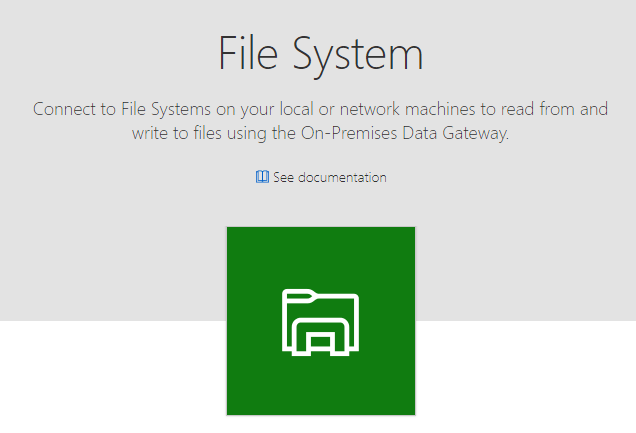
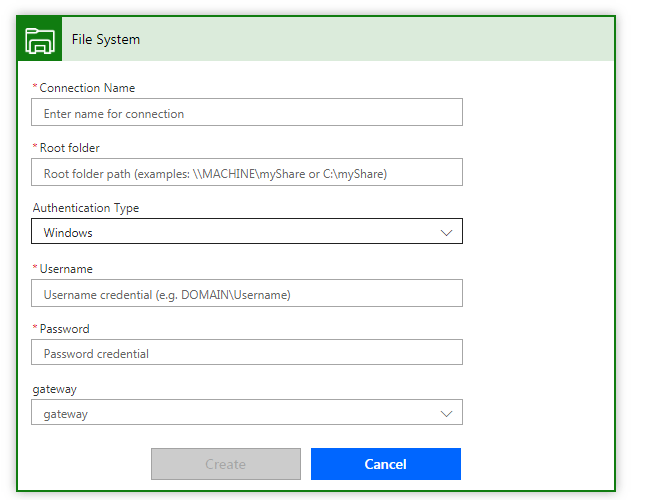
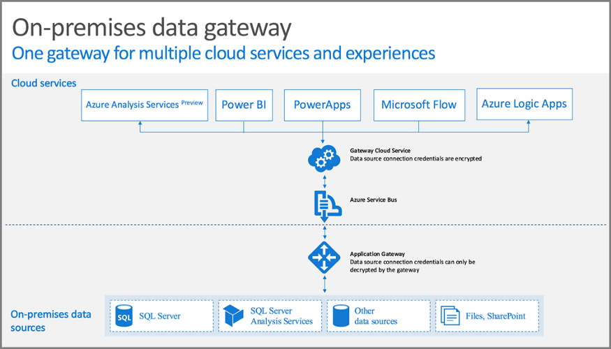

Microsoft Flow can connect to various cloud file systems which we are familiar with, e.g. OneDrive and SharePoint, but we often have some existing on-premise or local file system we would like to build some automation on. One of the tools to solve this requirement is that we can use file system connector in Microsoft flow, just with a few clicks, we can connect our local file system to Microsoft flow.

*Local File System Connector*

## Installation & Configuration
To use file system connector, you need to install an application on your PC.

### Installation Steps
1. Browse to [https://flow.microsoft.com](https://flow.microsoft.com) and click the gear icon on the top left hand corner
2. Select “Gateways”
3. Click “New gateway”
4. You will be redirected to [https://powerapps.microsoft.com/en-us/downloads/](https://powerapps.microsoft.com/en-us/downloads/)
5. Download “On-Premises Data Gateway”
6. Follow the instruction to install the application and remember the secrets you create during the installation

If you fail to installation, please check the requirement at [here](https://docs.microsoft.com/en-us/power-bi/connect-data/service-gateway-onprem)

### Microsoft Flow:
1. Add a new file system connection to Microsoft Flow
2. Give the connection a name, configure the path, input your domain credential as below

*Configure Local File System Connector*

## Mechanism
Put it simple, data source will send data to the gateway you installed in previous step firstly, then the gateway will send the data to Azure Service Bus which is a message broker. After that, Azure Service Bus will send data to cloud services depending on your connection, for example Azure Service Bus will send data to Microsoft Flow if you have such connection as configured above.

*Mechanism*

A Message broker does not only do data transmission job, but also allows us to use subscription model, i.e. the message broker can receive result from a single source (e.g. Local File System), but the result can be consumed by various parties (e.g. Microsoft Flow or Power BI)

Conclusion
Despite this article is about using Local File System Connector with Microsoft Flow, we can also use this connector in other Office 365 Cloud Services, e.g. PowerBI
