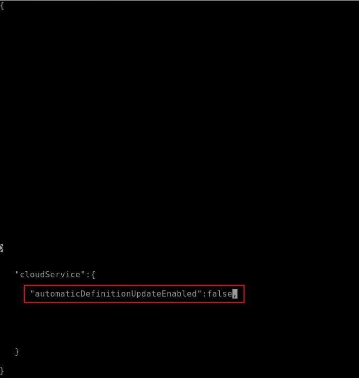

Microsoft Defender for Endpoint on Linux (MDATP) has a built-in antivirus engine which will protect you from file-based attacks. By default, this antivirus will update its definition automatically whenever there is a new version released. However, the latest version may remove some important files, thus there is a need to stop the automatic version update and rollback to specific version.

## Check current MDATP antivirus version and configuration
You can check MDATP's antivirus automatic update configuration and its version by typing
```bash
mdatp health
```
By default, MDATP's antivirus will update itself automatically.

*Check MDATP antivirus version and configuration*

## Stop MDATP antivirus definition automatic update
To freeze or rollback the antivirus definition, you need to stop its automatic update first. Otherwise, the version will change after a while.
To stop MDATP antivirus defintion automati update, you need to prepare a configuration file at */etc/opt/microsoft/mdatp/managed/mdatp_managed.json*
```json
...
  "cloudService": {
    ...
    "automaticDefinitionUpdateEnabled": true,
    ...
}
...
```

*Stop antivirus definition automatic update in configuration file*


*Antivirus definition automatic update disabled*

## Rollback MDATP antivirus definition to specific version
To rollback MDATP antivirus definition, you need to stop its service first. Use below commands to stop the service & perform the rollback
```bash
sudo systemctl stop mdatp.service
sudo mdatp definitions get --version [the version number that you would like to rollback to]
sudo systemctl start mdatp.service
```
Here, we downgrade the antivirus definition from version 88083 to version 88082.


*Rollback MDATP antivirus definition version*


*MDATP antivirus definition version downgraded*

## Update MDATP antivirus definition to the latest version
After the rollback, you may update MDATP antivirus definition to the latest version if you find the latest version won't hurt your app or you whitelist all impacted processes and files.

Here, we update the antivirus definition to the latest version, 88083.

```bash
sudo mdatp definitions update
```


*Update MDATP antivirus definition version*


*MDATP antivirus definition version updated*

## Conclusion
By using MDATP configuration file and commands, we can stop its automatic definition update, rollback to specific version and update it to specific version


*Other articles you may be interested:*
1. [Vulnerability Scanning with MDATP](/blog-posts/vulnerability-scanning-in-microsoft-defender-for-server/)