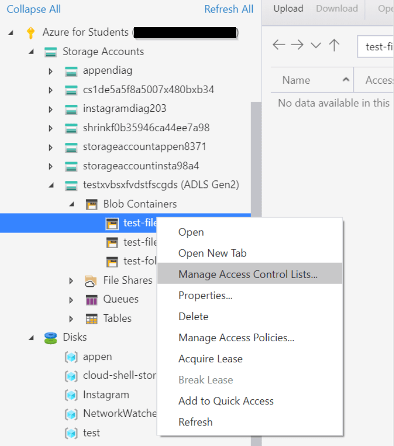

## Background
Azure Data Lake Gen 2 offers fine-grained access control on your data, it allows you to customize permission, defines permission settings per container, folder or file be because of its hierarchical namespace.

This article will cover below items
1. Container Public Access Level
2. Authorization Mechanisms
3. Container, Folder and Files Level Permission Settings

## Container Public Access Level
You can use 4 different ways to control permissions, they are
1. Private Container
2. Blob Level Public Access
3. Container Level Public Access

### Private Container
Only authorized users can access files in this container.

Private Container Example

*Private Container Example*

### Blob Level Public Access
External users can access any file insider the container given he/she has the corresponding file URL.

Blob URL

*Blob URL*

You can download the file with the URL directly

*Download blob from URL*

### Container Level Public Access
In contrast to Blob Level Public Access, external users need to know the blob URL before downloading the file, Container Level Public Access allows external users enumerate all files inside that container. You can do this by browsing the container URL in [Azure Storage Explorer](https://azure.microsoft.com/en-us/features/storage-explorer/)

Select connection type as "connect to public blob container" in Azure Storage Explorer

*Select connection type as 'connect to public blob container' in Azure Storage Explorer*


Type your container URL, your URL should be in this format:
```
https://<<your_storage-account_name>>.blob.core.windows.net/<<your_container_name>>
```

*Type your public container URL in Azure Storage Explorer*

You should be able to view your public container

*View Public Container in Azure Storage Explorer*


### Configure Public Access
First, you need to enable/disable public read access for your storage account. Enable it if you want to have Blob/Container Level Public Access for some containers, disable it if you want all containers private.

Remark: This setting applies to all containers inside this storage account.

Enable/Disable Blob Public Access
You should be able to view your public container

*Configure Blob Public Access*

Configure level of public access for a container

*Configure Public Access Level*

## Authorization Mechanisms
Assuming your container is set as “Private”, you can use 4 different ways to control permissions, they are
1. Shared Key Authorization
2. Shared Access Signature (SAS) Authorization
3. Role-based Access Control (Azure RBAC)
4. Access Control Lists (ACL)

### Shared Key Authorization
Shared Key Authorization allows authorized users gain full access on all resources in your Azure Data Lake. Azure Data Lake offers two shared keys, typically we usually use only one of them (primary key). When this primary key is comprised, we can switch the primary key with another one and regenerate the primary key.

Two Shared Keys

*Shared Key Authorization*

### Shared Access Signature (SAS) Authorization
Shared Access Signature (SAS) Authorization allows you generate a SAS token which others can use to authorize themselves, you can define the permission (e.g. read, write) and the token expiry date (i.e. others cannot use this token after the token expires). It is 
very convenient if you want to grant external users access to the file.

SAS token has two major limitations. First, you cannot revoke the token once it is generated, so you should set this token’s lifespan short enough, otherwise a long-lasting token will risk the integrity of your files. Second, SAS token applies to file only, you cannot set SAS token for a directory. Even you create a SAS tokens for each file, these SAS tokens are different. Therefore, it may be troublesome if you use SAS token to share many files to others. 


*Shared Access Signature Authorization*

### Role-based Access Control (Azure RBAC)
Role-based access control allows you leverage Azure built-in role to assign permissions on ALL data within Azure Data Lake Gen 2. 

There are two kinds of roles.

One of them allows user to “manage” the storage account, e.g. reading the Shared Keys, change the blob access tier, they do NOT have control on the data stored in Azure Data Lake Gen 2. Examples of these roles are “Owner”, “Contributor”, “Reader”.

Another type allows user to access the data in Azure Data Lake. Examples are “Storage Blob Data Owner”, “Storage Blob Data Contributor”, “Storage Blob Data Reader”.


*Azure Role Based Access Control Example*

### Access Control Lists (ACL)
Access Control Lists is the only authorization mechanism which allows you set permission per container, directory and files, you can set “Read”, “Write” and “Execute” on these objects.

There are two types of ACL, Access ACL and Default ACL, the former one determines the access control for that specific object, i.e. directory/files, the latter only applies to directories, it determines the default permission for child objects created in that directory. We will share more detail in next section.

Access ACL and Default ACL


*Access ACL and Default ACL*

## Container, Folder and Files Level Permission Settings
In [Azure Storage Explorer](https://azure.microsoft.com/en-us/features/storage-explorer/), you can set permission per container, folder and files via ACL. There two types of permissions, Access ACL and Default ACL, you may refer to ACL section for reference.

### Prerequisite
To allow others see the files in your storage account, you need to grant them “Reader” permission to the storage account and assign them “read” and “execute” permission to the container where the files are stored.

Add them as "Reader" in Azure Portal

*Assign users 'Reader' permission*

Right Click the container which you would like to set ACL

*Access Container Access Control Lists*

Assign user "read" and "execute" permission to the container

*Assign Users 'Read' and 'Execute' permission for container*

### Container Permission Settings
Right Click the container which you would like to set ACL

*Access Container Access Control Lists*

Set "Access ACL" and "Default ACL"

*Configure Access Control Lists For Container*

### Folder Permission Settings
Choose the folder you want to set permission and click "Manage ACLs"

*Access Folder Access Control Lists*

Set "Access ACL" for that folder and "Default ACL" for child items of that folder

*Configure Access Control Lists For Folder*

Check default permission of a file inside that folder

*Check default permission of a file inside folder have default ACL configured*

Check default permission of a sub folder inside that folder

*Check default permission of a sub folder inside folder have default ACL configured*

### File Permission Settings
Choose the file you want to set permission and click "Manage ACLs"

*Access File Access Control Lists*

Set "Access ACL" for that file

*Configure 'Access ACL' of a file*

Blog: [https://joeho.xyz](https://joeho.xyz)

LinkedIn: [https://www.linkedin.com/in/joe-ho-0260758a](https://www.linkedin.com/in/joe-ho-0260758a)