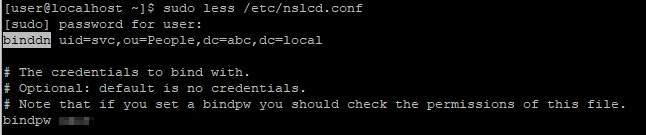

Creating local accounts for a Linux machine is easy, but managing numerous accounts for thousands of machines can be a disaster. With OpenLDAP, you can store accounts in the server and use them to log in to all of your machines. This centralization makes account management easy and allows you to reuse created accounts to log in to new machines.

In this guide, I will explain how to configure the host to use OpenLDAP for authentication.

## Prerequisites
You need to have a OpenLDAP server and an account which belongs to **posixAccount** and **shadowAccount**. This [guide](/blog-posts/install-and-configure-openldap-server-in-centos7/) will help you meet the prerequisites.

## Configuration

### Create Service Account (Optional) on the server
If you disable anonymous bind on the LDAP server as this [guide](/blog-posts/disable-anonymous-bind-for-openldap-in-centos7/), you need to create a service account & put service account credentials in a configuration file of the host. One of the packages the host use to authenticate to the OpenLDAP server (**nss-pam-ldapd**) will perform anonymous bind to the OpenLDAP server & check if the account we try to login exists or not. As we disable anonymous bind, we need to supplement a service account credentials to **nss-pam-ldapd** to do authenticated bind instead.

Create a service account, **uid=svc,ou=People,dc=abc,dc=local**
```bash
cat > svc.ldif << EOF
dn: uid=svc,ou=People,dc=abc,dc=local
objectClass: inetOrgPerson
objectClass: posixAccount
objectClass: shadowAccount
uid: svc
sn: svc
cn: svc
uidNumber: 90001
gidNumber: 90001
homeDirectory: /home/svc
shadowMin: 0
shadowMax: 9999
shadowWarning: 7
userPassword: {CRYPT}x
shadowLastChange: 20000
EOF

sudo ldapadd -x -W -D "cn=admin,dc=abc,dc=local" -f svc.ldif # replace cn=admin,dc=abc,dc=local by your admin cn

sudo ldappasswd -x -D cn=admin,dc=abc,dc=local -W -S uid=svc,ou=People,dc=abc,dc=local # Change password of service account

sudo ldapsearch -x -LLL -b dc=abc,dc=local '(uid=svc)' -D cn=admin,dc=abc,dc=local -W # Verify if service account is created
```


### Install OpenLDAP client and Name Service Switch (NSS) module on the host
OpenLDAP client allows us to communicate with OpenLDAP servers & NSS module does identity and authentication management.
```bash
sudo yum install -y openldap-clients nss-pam-ldapd
```
### Configure OpenLDAP authentication on the host
Configure the host to use OpenLDAP for user login
```bash
sudo authconfig --enableldap --enableldapauth --ldapserver=<<your-openLDAP-server-ip>> --ldapbasedn="dc=<<your-dc>>,dc=<<your-dc>>" --enablemkhomedir --update
```

(Optional) If you disable anonymous bind, add the credentials of service account you just created for nslcd service to do authenticated bind
```bash
sudo sed 's/^#binddn.*/binddn uid=svc,ou=People,dc=abc,dc=local/' /etc/nslcd.conf -i
sudo sed 's/^#bindpw.*/bindpw <<password>>/' /etc/nslcd.conf -i
```

Restart the service
```bash
sudo systemctl restart nslcd
```
## Test LDAP login on the host
```bash
su - joe
```

You are asked to change the password in the first login because we set **shadowLastChange** as 0.

## Conclusion
In this guide, I share the benefit of using accounts in centralized OpenLDAP server for machine login, how to configure host to allow accounts in OpenLDAP server to login your host and advanced configuration for OpenLDAP server which disable anonymous bind.

Blog: [https://joeho.xyz](https://joeho.xyz)

LinkedIn: [https://www.linkedin.com/in/ho-cho-tai-0260758a](https://www.linkedin.com/in/ho-cho-tai-0260758a)