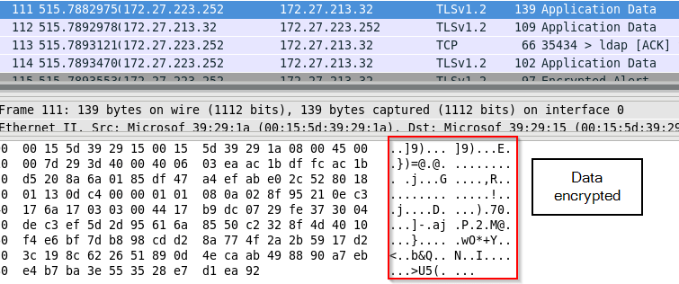
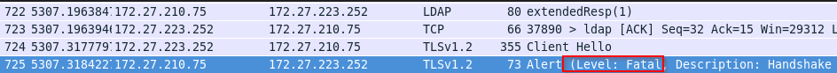

By default, the communication between an OpenLDAP server and client is unencrypted, making it vulnerable to a man-in-the-middle attack. An attacker can intercept and view plaintext data, including the password you send to the OpenLDAP server for authentication. To secure this connection, we can encrypt the traffic to prevent the attacker from intercepting any sensitive data.

In this guide, I will show you how to configure StartTLS on an OpenLDAP server, enabling clients to communicate with the server using StartTLS and allowing LDAP accounts to log in to the host over an encrypted tunnel with the integration of nss-pam-ldapd.

## Concepts
In general, there are two ways to encrypt LDAP traffic with SSL/TLS.

First, we have LDAPS. The client and server negotiate the encryption cipher and exchange the key first. Then, following LDAP communication, will be encrypted by the key. This connection operates on port 636.

Second, we have StartTLS. Instead of cipher negotiation and key exchange at first, the client will send an LDAP message to ask the server if it supports TLS or not. If yes, they will proceed with cipher negotiation and key exchange, and the following LDAP communication will be encrypted by the key. This connection will use the same port as traditional LDAP, port 389.

Compared to LDAPS, StartTLS allows you to use the same port to support clients that use or don't use SSL/TLS. However, StartTLS is susceptible to downgrade attacks, such as STRIPTLS. An attacker will tamper with the initial StartTLS response from the server to mislead the clients that the server doesn't support SSL/TLS. As a result, applications on the client may fall back to an unencrypted LDAP connection and suffer from sniffing attacks again.

### Unencrypted LDAP traffic
As mentioned, LDAP traffic is transmitted in plain text by default. If the client does not request to initialize encrypted tunnel, i.e. LDAPS or StartTLS, the traffic will be in plain text and attacker can steal sensitive data, e.g. password in the bind request.
```bash
ldapsearch -D cn="admin,dc=abc,dc=local" -W -b "dc=abc,dc=local" objectClass=* -H ldap://ldap1.abc.local
```


### Encrypted LDAP traffic - StartTLS
If the client requests to initialize an encrypted tunnel and the server supports it, the traffic will be encrypted. If the client chooses to adopt StartTLS, it will send StartTLS first to establish an SSL/TLS tunnel, and the following traffic will be encrypted.
```bash
ldapsearch -D cn="admin,dc=abc,dc=local" -W -b "dc=abc,dc=local" objectClass=* -H ldap://ldap1.abc.local -Z # Z flag to initialize StartTLS
```



## Failed SSL/TLS handshake for StartTLS
If the client sends a StartTLS request to the server, but the server doesn't accept it, the SSL/TLS handshake will fail. Worth mentioning, it does not prevent the client from sending first unencrypted LDAP bind request to the server, subsequent data exchange will be terminated by the server as it doesn't support TLS.
```bash
ldapsearch -D cn="admin,dc=abc,dc=local" -W -b "dc=abc,dc=local" objectClass=* -H ldap://ldap3.abc.local -Z
# ldap3.abc.local is a LDAP server that doesn't support SSL/TLS
```


First LDAP bind request containing sensitive data is still being sent.

Due to SSL/TLS negotiation failure, the server closes the connection after the first LDAP bind request sent from the client.


Depends on your application, it may initialize traditional LDAP request (i.e. unencrypted LDAP request) afterwards.
## Prerequisites
You need to have
1. a OpenLDAP server and an account which belongs to **posixAccount** and **shadowAccount**, which is documented at [guide](/blog-posts/install-and-configure-openldap-server-in-centos7/)
2. a Centos 7 client which use nss-pam-ldapd to authenticate to OpenLDAP server

## Server Configuration

### Generate private key and certificates for OpenLDAP server
Create root CA (Certificate Authority) key and certificate
```bash
cd /etc/openldap/certs/
openssl genrsa -out rootCA.key 2048
openssl req -x509 -new -nodes -subj "/CN=ldap-ca.abc.local" -key rootCA.key -sha256 -days 1024 -out rootCA.pem
```
Create Certificate Signing Request (CSR)
```bash
openssl genrsa -out ldap.key 2048
openssl req -new -subj "/CN=ldap1.abc.local" -key ldap.key -out ldap.csr
```
Sign the CSR & obtain ldap server certificate
```bash
openssl x509 -req -in ldap.csr -CA rootCA.pem -CAkey rootCA.key -CAcreateserial -out ldap.crt -days 3650 -sha256
```

### Generate private key and certificates for another OpenLDAP server
If you have another OpenLDAP server, you just need to create a new CSR, use the same CA certificate to sign the CSR and obtain certificate with different **CN**, e.g. ldap2.abc.local
For example,
```bash
openssl genrsa -out ldap.key 2048
openssl req -new -subj "/CN=ldap2.abc.local" -key ldap.key -out ldap.csr # Generate CSR
openssl x509 -req -in ldap.csr -CA rootCA.pem -CAkey rootCA.key -CAcreateserial -out ldap.crt -days 3650 -sha256 # Sign the CSR
```
### Configure OpenLDAP server to use certificates and private key for LDAP traffic encryption
Configure OpenLDAP server to use root CA certificates, its own private key and certificate for SSL/TLS establishment.

```bash
# Configure root CA certificate
cat > ca_certificate.ldif << EOF
dn: cn=config
changetype: modify
replace: olcTLSCACertificateFile
olcTLSCACertificateFile: /etc/openldap/certs/rootCA.pem
EOF

# Configure root CA certificate
cat > key_ and_certificate.ldif << EOF
dn: cn=config
changetype: modify
replace: olcTLSCertificateFile
olcTLSCertificateFile: /etc/openldap/certs/ldap.crt

dn: cn=config
changetype: modify
replace: olcTLSCertificateKeyFile
olcTLSCertificateKeyFile: /etc/openldap/certs/ldap.key
EOF

# Apply setting for root CA certificate configuration
sudo ldapmodify -Y EXTERNAL  -H ldapi:/// -f ca_certificate.ldif

# Apply setting for its own key and certificate configuration
sudo ldapmodify -Y EXTERNAL  -H ldapi:/// -f and_certificate.ldif
```

Remark: If I merge these 2 ldif configuration file into a single ldif file and apply this single ldif file, I will encounter "ldap_modify: Other (e.g., implementation specific) error (80)", not sure if it's a bug or something

## Test StartTLS on CentOS 7 client
### DNS Configuration on CentOS 7 client
You need to make sure that you can resolve your OpenLDAP server ip from the common name stated in the certificate, you can do it by adding a DNS entry in the DNS server or add it in DNS host file as below
```bash
echo "<<your-openldap-server-ip>> <<ldap-common-name>>" | sudo tee -a /etc/hosts
```


### Upload Root CA certificate to CentOS 7 client
Next, upload the root CA certificate to the client, you may put the certificate under **/etc/openldap/certs**
```bash
sudo scp user@ldap1.abc.local:/etc/openldap/certs/rootCA.pem /etc/openldap/certs
```


### Configure LDAP client TLS certificate on CentOS 7 client
Ask LDAP to use your Root CA certificate for SSL/TLS establishment
```bash
echo "TLS_CACERT /etc/openldap/certs/rootCA.pem" | sudo tee -a /etc/openldap/ldap.conf
```

### Initialize StartTLS LDAP test from the CentOS 7 client
Perform ldapwhoami with StartTLS.
```bash
ldapwhoami -x -D cn="admin,dc=abc,dc=local" -W -H ldap://ldap1.abc.local -Z # Z flag for StartTLS
```
If you can see the response, then you successfully talk to OpenLDAP over SSL/TLS


## Enable StartTLS for OpenLDAP account login on CentOS 7 client with nss-pam-ldapd
If your client uses nss-pam-ldapd to login LDAP accounts, you can follow below guide to configure StartTLS for it.
### Configure StartTLS setting for nslcd
```bash
sudo authconfig  --enableldaptls --update # Specify StartTLS
echo "tls_cacertfile  /etc/openldap/certs/rootCA.pem" | sudo tee -a /etc/nslcd.conf # Specify Root CA certificate
# Use common name of the certificate, otherwise you will encounter connection error due to mismatch between hostname and the common name in the certificate (More in the below)
sudo authconfig --ldapserver=ldap1.abc.local --update
sudo systemctl restart nslcd
```


### Test StartTLS for OpenLDAP account login on CentOS 7 client


A terminal to run nslcd in debug mode (Optional), it can help you debug and understand what is happening under the hood
```bash
sudo systemctl stop nslcd
sudo nslcd -d
```

The error due to mismatch between hostname and the common name in the certificate

Another terminal to login LDAP account
```bash
su - joe
```


## Conclusion
This guide covers benefits of using StartTLS for LDAP, how StartTLS LDAP works, how to configure OpenLDAP server to accept StartTLS, how to establish StartTLS LDAP connection and how to let your clients use StartTLS during authentication to LDAP server.

Blog: [https://joeho.xyz](https://joeho.xyz)

LinkedIn: [https://www.linkedin.com/in/ho-cho-tai-0260758a](https://www.linkedin.com/in/ho-cho-tai-0260758a)