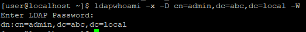
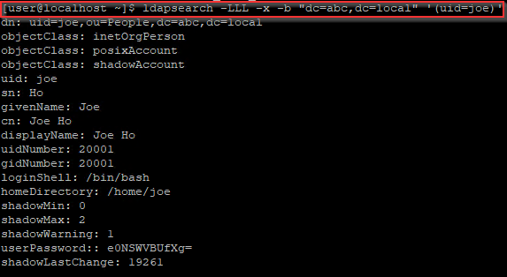
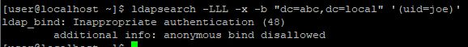

LDAP bind is a process which the client tries to authenticate themselves to the server. Depends on the server set up, such bind request sent from client may contain no credentials (i.e. anonymous bind).

In this guide, I will share how to configure the LDAP bind feature.

## Concept
Before diving into the configuration, it's better to know the types of LDAP bind.

### Anonymous bind
Anonymous bind is that you present no distinguished name (you may treat it as an account name) and password in the bind request, the LDAP server will treat you as an anonymous. Usually, we will combine it with LDAP Access Control (ACL) to prevent anonymous from knowing some sensitive data if you decide to open part of the LDAP data to the public.


### Unauthenticated bind
Unauthenticated bind allows you to present distinguished name and **no** password. By default, it's disabled, as many applications don't realize that they can still bind to LDAP server with incorrect password.

### Authenticated bind
Authenticated bind requires the client to provide distinguished name and password.


## Disable anonymous bind for OpenLDAP
By default, you can query LDAP data as an anonymous
```bash
ldapsearch -LLL -x -b "dc=abc,dc=local" '(uid=joe)'
```

Now, we will disable it. Create a disable_bind_anon.ldif with below content
```bash
dn: cn=config
changetype: modify
add: olcDisallows
olcDisallows: bind_anon
```
Apply the configuration
```bash
sudo ldapadd -Y EXTERNAL -H ldapi:/// -f disable_bind_anon.ldif
```
If we try again, we can no longer query the user
```bash
ldapsearch -LLL -x -b "dc=abc,dc=local" '(uid=joe)'
```


## Conclusion
In this guide, we discuss what bind is, types of bind and how to disable anonymous bind

Blog: [https://joeho.xyz](https://joeho.xyz)

LinkedIn: [https://www.linkedin.com/in/ho-cho-tai-0260758a](https://www.linkedin.com/in/ho-cho-tai-0260758a)