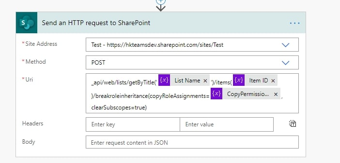
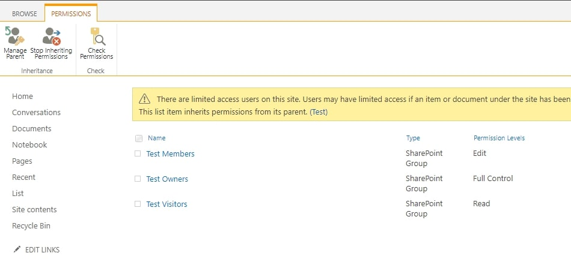
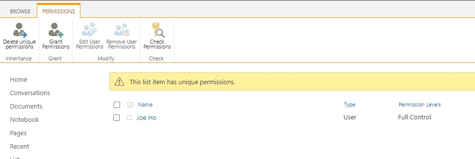

## Background
In SharePoint Online, we sometimes need to restrict/edit permission for each list item, which is trivial in GUI, but it invovles a few extra steps if you want to do it programmatically.

## Setup
1. SharePoint Online List
2. Power Automate

Power Automate is used for sake of authentication simplicity, you need to use an access token to invoke SharePoint API in general.

More on Authentication:
1. [https://medium.com/@anoopt/access-sharepoint-data-using-postman-eec5965400f2](https://medium.com/@anoopt/access-sharepoint-data-using-postman-eec5965400f2)
2. [https://medium.com/@anoopt/accessing-sharepoint-data-using-postman-sharepoint-rest-api-76b70630bcbf](https://medium.com/@anoopt/accessing-sharepoint-data-using-postman-sharepoint-rest-api-76b70630bcbf)

## Steps

### Outline
1. By default, a list item inherits the permission from the list, so
We will break the inheritance of the list item first
2. We will erase all permissions settings of the list item [Optional]
3. We will grant permission to other users/groups

Remark: We can complete 1 & 2 with a single API call

### Break Inheritance
A single API call will do the job.
```
POST <Site URL>/_api/web/lists/getByTitle('<List Name>')/items(<Item ID>)/breakroleinheritance(copyRoleAssignments=<CopyPermissionFromParent>, clearSubscopes=true)
* Site URL: The SharePoint site which your list belongs to
* List Name: The SharePoint list which your list item belongs to
* Item ID: The SharePoint item ID
* CopyPermissionFromParent (true or false): Whether to copy the list permission. If it is false, this API call will erase all permissions and grant "Full Control" permission to your account (A minor drawback)
```

*Make API Call*


*Before Breaking Inheritance*


*After Breaking Inheritance*

### Grant Permission to User/Group
We need to gather two pieces of information, User/Group ID and Permission ID, then we can call a API with IDs to grant user/group permission.

#### Gather User/Group ID and Permission ID
To retrieve user/group ID, you can call below API with user email or group name.

```
POST <Site URL>/_api/web/SiteUsers/getByEmail('<User Email/Group Name>')
* Site URL: The SharePoint site which your list belongs to
* User Email/Group Name: User Email/Group Name
```

To retrieve Permission ID, you can call below API with permission name.
```
POST <Site URL>/_api/web/roledefinitions/getbyname('<Permission Name>')/id
* Site URL: The SharePoint site which your list belongs to
* Permission Name: Permission name
```

Blog: [https://joeho.xyz](https://joeho.xyz)

LinkedIn: [https://www.linkedin.com/in/joe-ho-0260758a](https://www.linkedin.com/in/joe-ho-0260758a)