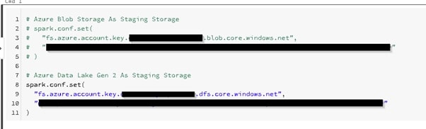
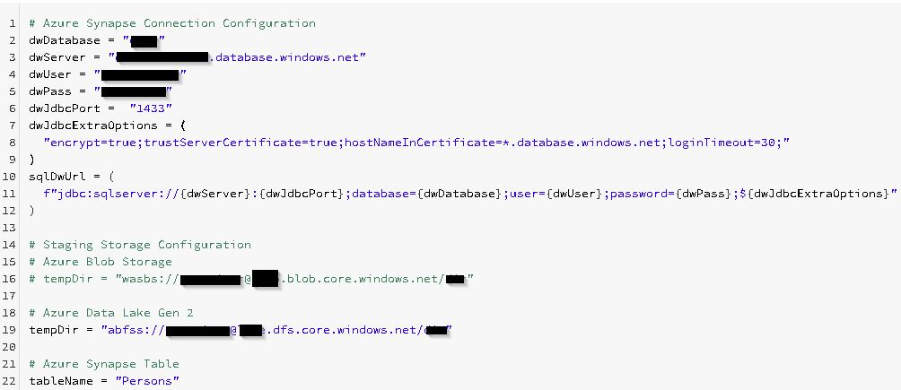
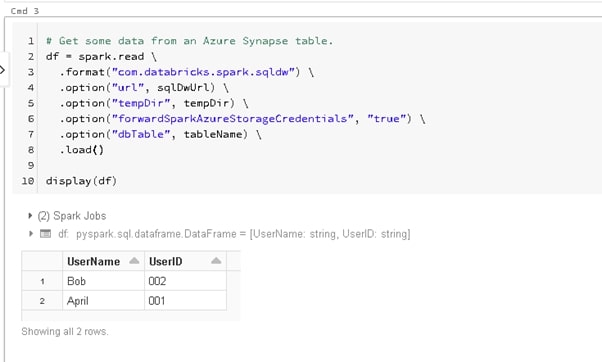
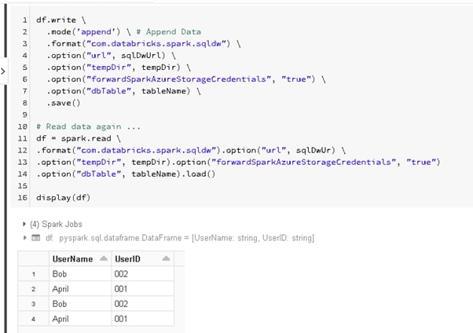
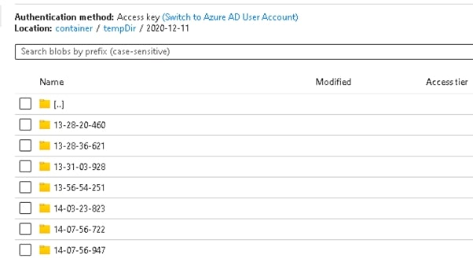
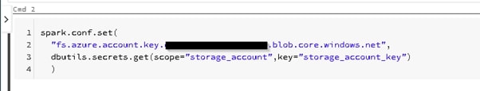

## Background
With Azure Databricks, we can easily transform huge size of data in parallel and store the transformed data in different Azure services, one of them is Azure Synapse (formerly SQL DW). Azure Databricks has built-in connector which lets us read and write data easily from Azure Synapse.

## Prerequisite
1. Azure Databricks Workspace
2. Azure Blob Storage or Azure Data Lake Gen 2
3. Azure Synapse Instance
4. Azure Synapse User Credentials


## Steps

### Configure storage key in notebook session
This will configure your storage credentials in your notebook session, which we will use them to connect to that storage. This storage acts as a staging storage when you read and write data from Azure Synapse. Currently, only Azure Blob Storage and Azure Data Lake Gen 2 are supported, they have slightly different configurations. Below are session configuration for both types of storage.

#### Azure Blob Storage As Staging Storage

```python
# Python

spark.conf.set(fs.azure.account.key.<<your-storage-account-name>>.blob.core.windows.net, ”<<your-storage-account-access-key>>”)
```

```python
# Python

spark.conf.set(fs.azure.account.key.<<your-storage-account-name>>.blob.core.windows.net, ”<<your-storage-account-access-key>>”)
```

#### Azure Data Lake Gen 2 As Staging Storage
```python
# Python

spark.conf.set(fs.azure.account.key.<<your-storage-account-name>>. dfs.core.windows.net, ”<<your-storage-account-access-key>>”)
```


*Configure storage key in notebook session*


### Configure Azure Synapse connection
Next, we will define below variables
1. Azure Synapse connection string
2. Staging storage folder (i.e. where some temporary data will be written to when you read/write data from/to Azure Synapse)
3. An Azure Synapse Table which you will read/write data from/to Azure Synapse

```python
# Python

# Azure Synapse Connection Configuration
dwDatabase = <<your-database-name>>
dwServer = <<your-sql-sever-name>>
dwUser = <<your-database-account>>
dwPass = <<your-database-account-password>>
dwJdbcPort =  "1433"
dwJdbcExtraOptions = "encrypt=true;trustServerCertificate=true;hostNameInCertificate=*.database.windows.net;loginTimeout=30;"
sqlDwUrl = f"jdbc:sqlserver://{dwServer}:{dwJdbcPort};database={dwDatabase};user={dwUser};password={dwPass};${dwJdbcExtraOptions}"
  
# Staging Storage Configuration
# Azure Blob Storage
# tempDir = "wasbs://<<container>>@<<your-storage-account-name>>.blob.core.windows.net/<<folder-for-temporary-data>>"

# Azure Data Lake Gen 2
tempDir = "abfss://<<container >>@<<your-storage-account-name>>.dfs.core.windows.net/<<folder-for-temporary-data>>"

# Azure Synapse Table
tableName = <<your-azure-synapse-table-to-read-or-write>>
```


*We will read 'Persons' table*

### Read Data from Azure Synapse
Then, we will try to read data from Azure Synapse

```python
# Python
df = spark.read \
  .format("com.databricks.spark.sqldw") \
  .option("url", sqlDwUrl) \
  .option("tempDir", tempDir) \
  .option("forwardSparkAzureStorageCredentials", "true") \
  .option("dbTable", tableName) \
  .load()
```

*Read data from Azure Synapse*

### Write Data to Azure Synapse
Finally, we will try to write data to Azure Synapse

```python
# Python
df.write \
  .mode('append') \ # Append Data
  .format("com.databricks.spark.sqldw") \
  .option("url", sqlDwUrl) \
  .option("tempDir", tempDir) \
  .option("forwardSparkAzureStorageCredentials", "true") \
  .option("dbTable", tableName) \
  .save()
```


*Write data to Azure Synapse*

### Bonus: Why do we need staging storage
As mentioned above, staging folder is needed to store some temporary data whenever we read/write data from/to Azure Synapse. Whenever we read/write data, we actually leverage [PolyBase](https://docs.microsoft.com/en-us/sql/relational-databases/polybase/polybase-guide?view=sql-server-ver15 "PolyBase") to move the data, which staging storage is used to achieve high performance.


*Data in temporary storage*

### Another Bonus: Secret Management in Azure Databricks
The code above put our secrets, e.g. user credentials, storage key in pain text. Actually, we should hide them in the notebooks. You can refer to this [guide](/blog-posts/how-to-store-secrets-in-azure-databricks/) for more detail.


*Retrieve storage key from databricks secret*

Blog: [https://joeho.xyz](https://joeho.xyz)

LinkedIn: [https://www.linkedin.com/in/joe-ho-0260758a](https://www.linkedin.com/in/joe-ho-0260758a)