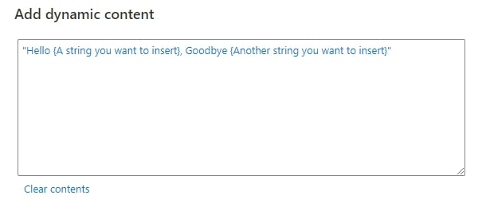
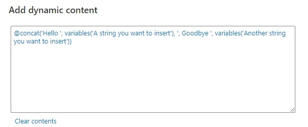
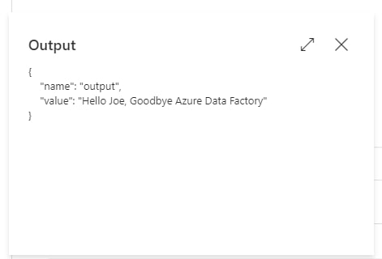
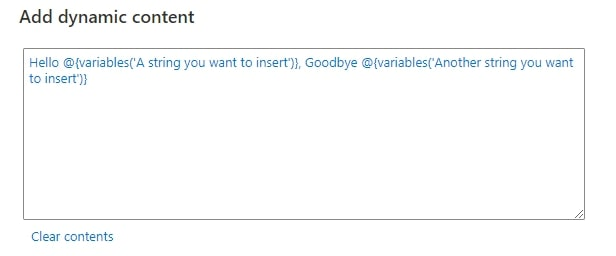
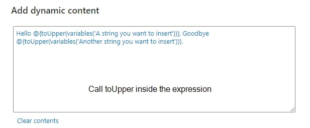
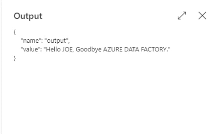

## Background
Azure Data Factory allows us to add dynamic content in certain fields. Sometimes, we want to insert the value of variables, value of function or output of last activity into our string for dynamic content.

*String Interpolation Example Illustration*

## Solution
There are two approaches to achieve that. 

1. Azure Data Factory’s built-in function “concat” 
2. String Interpolation in Azure Data Factory 

### Azure Data Factory’s built-in function “concat” 
Azure Data Factory has a built-in function “concat” which helps us concatenate  string together, but this makes the dynamic content less readable. 

*Use built-in ‘concat’ function in Dynamic Content Modal*

*Output — Azure Data Factory built-in ‘concat’ function*

### String Interpolation in Azure Data Factory 
Actually, we can do string interpolation in Azure Data Factory, which is similar to other programming languages, this approach can make our dynamic content much more to comprehend. 

To achieve string interpolation, please put your variable inside “@{}”, i.e. @{your_variable_expression}. For example, it should be “@{variables(‘variable_name’)}” if your variable name is “variable_name”.

*Use String Interpolation in Dynamic Content Modal*

*Output — Azure Data Factory String Interpolation*

#### Bonus: Call functions with String Interpolation
On top of that, String Interpolation allows you to call other Azure Data Factory built-in functions inside the expression. 

*Use String Interpolation in other functions*

*Output — String Interpolation inside other functions*

Medium Post: [https://joeho-15265.medium.com/how-to-do-string-interpolation-in-azure-data-factory-8d2f56e192ee](https://joeho-15265.medium.com/how-to-do-string-interpolation-in-azure-data-factory-8d2f56e192ee)

Blog: [https://joeho.xyz](https://joeho.xyz)

LinkedIn: [https://www.linkedin.com/in/joe-ho-0260758a](https://www.linkedin.com/in/joe-ho-0260758a)