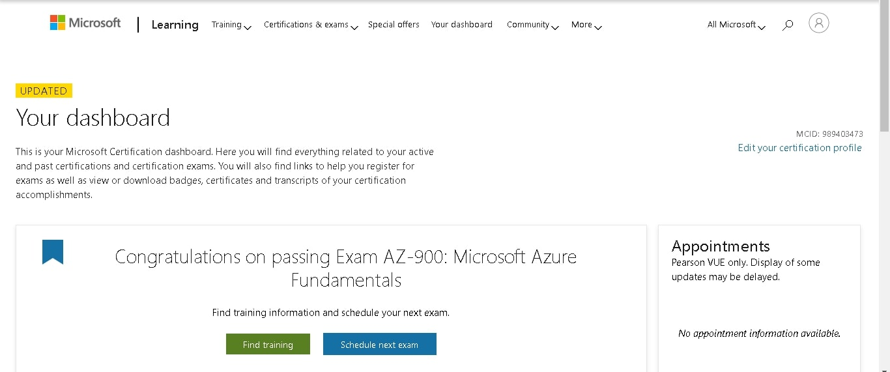
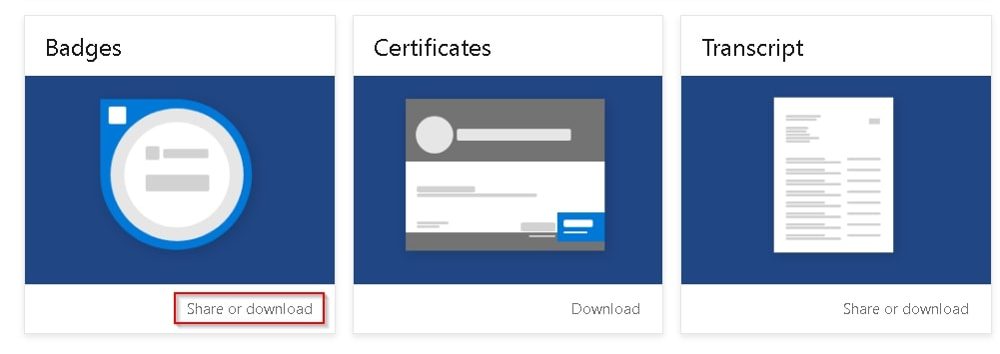
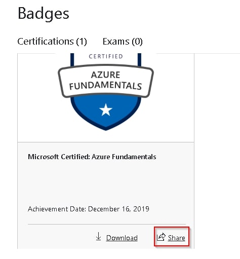
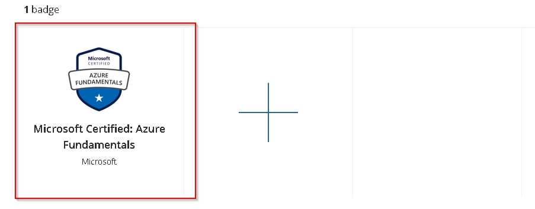
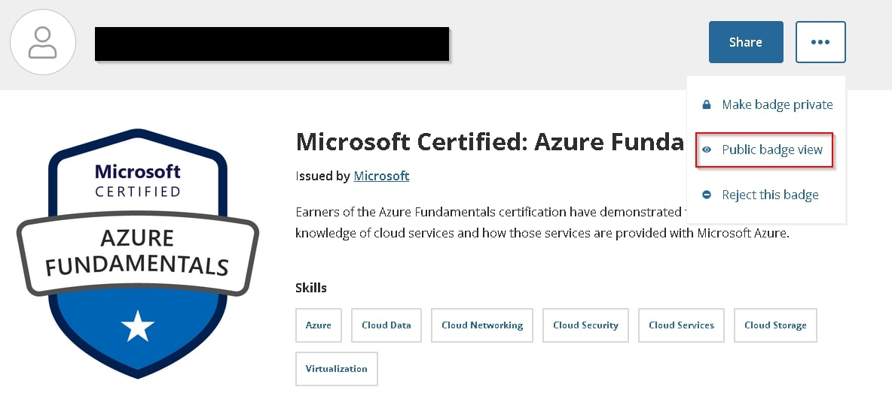
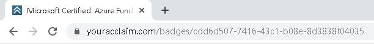

## Background
Microsoft's Azure is one of the major cloud computing service, it is the second largest Public Cloud Service with about [19% of market share](https://www.statista.com/chart/18819/worldwide-market-share-of-leading-cloud-infrastructure-service-providers/ "Market Share"). Considering the growth in public cloud service, learning Azure definitely brings you more career opportunities and growth, you may earn [15% higher salary](https://www.microsoft.com/en-us/learning/certification-benefits.aspx "Salary") as reported by Microsoft if you are certificated. Microsoft offers lots of Azure related certifications for different kind of roles, e.g. Developers, IT Administrators and Data Scientists. 

One of the certifications is Microsoft Certified Azure Fundamentals, you can be certificated once you pass the exam, AZ-900, which aims to examine your knowledge on cloud computing service and Azure fundamental. This certificate is optional if you would like to pursue advance level of certificate, e.g. associate level and expert level. However, it will let you gain more insights on Azure, especially if you are a beginner on Azure or Cloud Computing.

## Exam AZ-900 Detail
It is [60 minutes long](https://techcommunity.microsoft.com/t5/ITOps-Talk-Blog/Exam-review-AZ-900-Microsoft-Azure-Fundamentals/ba-p/565041 "Detail"). 

It focuses on four major areas
* cloud concepts (15-20%)
* core Azure services (30-35%)
* security, privacy, compliance, and trust (25-30%)
* pricing and support (20-25%).

For each major area, the exam will cover different skills. Also, the skills measured are updated constantly, so the coverage of the exam might be slightly different. You may visit [here](https://docs.microsoft.com/en-us/learn/certifications/exams/az-900#certification-exams "AZ-900 Detail") for more information.

## Personal Background
I have some experience in Azure Administration, for example App Management and Microsoft Graph API Management. Regarding development, I tried a few products, virtual machines, Azure Automation and Key Vault.

Hence, I have some fundamental knowledge on Azure and cloud computing. If you want to know more, you may visit my LinkedIn and Blog, links are at the bottom of this article.

Therefore, you may skip some of the materials below if you have already known the basics of Azure. You may also test your familiarity with exercises below, then you focus on areas you are less familiar with.

## My exam experience on AZ-900
AZ-900 is slightly more difficult than I expected. 

You need to know computing services types (e.g. IaaS, PaaS and SaaS), a wide range of Azure products, Security on Azure and Support on Azure. You don't need to be very familiar with them or have hands-on experience, but at least you need to know what they are. 

On top of that, you need to know the difference of two similar products. For example, Network Security Group (NSG) and Azure Firewall can block network traffic, but in what scenario you should use NSG rather than Azure Firewall.

Overall, the time for completing the exam is also definitely enough, I completed the whole exam in about 30 minutes. 

Before the exam, I used some of the below materials and resources for preparation.
1. Microsoft Learn - Azure Fundamentals ([https://docs.microsoft.com/en-us/learn/paths/azure-fundamentals/](https://docs.microsoft.com/en-us/learn/paths/azure-fundamentals/))
2. Azure Sandbox (You can try some Azure Services without creating a subscription)
3. Azure Subscription (e.g. Azure Free Account with valid credit card provided, Azure Student Account)
4. [Azure Exercises](https://www.examtopics.com/exams/microsoft/az-900/view/1)
5. A series of Youtube videos on questions types ([https://www.youtube.com/playlist?list=PLahhVEj9XNTdZrAYjA7mq4bH1X5cTykpH](https://www.youtube.com/playlist?list=PLahhVEj9XNTdZrAYjA7mq4bH1X5cTykpH))
6. Azure Practice Exam at [Linux Academy](https://linuxacademy.com/course/microsoft-azure-fundamentals-az-900-exam-prep/) (7 days free trial) (I didn't try this, but it's free, why not have a try?)

## Suggested Study Plan

### 1. Azure Fundamentals (10 hours)
Azure Fundamentals Series should be the primary resource, you can learn the basics of Azure and common services in Azure. 

This series has 12 modules in total and most of the modules can be completed within an hour, so you don't need to study all modules at a time. In addition, each module is independent of another module, so you may skip some of them if you are already familiar with some modules.

There are two additional benefits these modules can bring. First, each module contains a short quiz, so you can test your knowledge on that module and study from mistakes. Second, some module will let you create a Azure Sandbox, you can get some hands-on experience on that Sandbox without inputting credit card information, e.g. [this azure exercise](https://docs.microsoft.com/en-us/learn/modules/welcome-to-azure/4-exercise-create-website)

### 2. Azure Sandbox/Azure Trial (5 hours)
Although Azure Fundamentals explains the concepts well, it is still hard to imagine the actual steps and process sometimes, so having hands on experience definitely helps.

If you have an Azure subscription, I strongly recommend you to try a few of functionalities, e.g. resources group, virtual machines. If you have no idea on what you should try, you may also follow the instructions in some of the Azure Fundamentals Modules, e.g. [editing dashboards](https://docs.microsoft.com/en-us/learn/modules/tour-azure-portal/4-exercise-work-with-blades).

If you don't want to provide your credit card to Microsoft and still want to try some features, I recommend you to try Azure Sandbox. Azure Sandbox acts like normal Azure Subscription with limited features, but you can access the Azure Portal and try a few services, e.g. creating management group, policies.

### 3. Azure Exercises (5 hours)
After studying, I encourage you to do some exercises to examine your knowledge. You may watch this [Youtube playlist](https://www.youtube.com/playlist?list=PLahhVEj9XNTdZrAYjA7mq4bH1X5cTykpH) and know what kinds of questions Azure Exam will ask. 

Then, you may visit [this set of free exercises](https://www.examtopics.com/exams/microsoft/az-900/view/1) which has 147 questions in total. I have found several websites sharing the same exercises as this website, but this website is better, as people will discuss some questions in the comment section of each question, so you will know why your answer is wrong. 

However, I don't agree with the answer of some questions, as I think those answers are wrong sometimes. If you don't agree with the answer of that question, you may refer to the comment section to see if someone else share the same idea as you.

## Kind Advice
1. Have a good rest before the exam
2. It is ok to fail, as it does not affect you to pursue other advance certification
3. Remember to bring 2 kinds of personal identification. Primary ID would be your ID card or passport. Secondary ID would be something containing your name and signature, e.g. credit card.
4. Arrive test center 15 minutes before the exam

## Post-Exam
After you complete the exam, you will know the result immediately. It describes how good you perform in areas which the exam examines, you can further learn from areas you are rather weak at.

If you pass the AZ-900 Exam, you can view your certification on dashboard and share the link which someone else can view your certification.

1. Browse to the [dashboard](https://www.microsoft.com/en-us/learning/dashboard.aspx) and login
    
2. Choose the badge you want to share
    
3. Click "Share"
    
4. Sign Up/In if necessarily
5. Choose the badge in Accliam Dashboard
    
6. Click "Public badge view"
    
7. Click "Public badge view"
    

This post is also publised in Medium, [https://medium.com/@joeho_15265/20-hours-to-pass-azure-exam-az-900-b8afe5383ce4](https://medium.com/@joeho_15265/20-hours-to-pass-azure-exam-az-900-b8afe5383ce4)

Blog: [https://joeho.xyz](https://joeho.xyz)

LinkedIn: [https://www.linkedin.com/in/joe-ho-0260758a](https://www.linkedin.com/in/joe-ho-0260758a)