## Background
In Azure Databricks, we can write code to perform data transformation on data stored in various Azure Services, e.g. Azure Blob Storage, Azure Synapse. However, as other programs, sometimes, you want to protect credentials used in Azure Databricks, Azure Databricks provides a solid secret management approach to help you achieve that.

## Steps

### Prepare Databricks command-line interface (CLI) in Azure Cloud Shell

#### Configure your cloud shell environment

Open Cloud Shell & make sure you select “Bash” for the Cloud Shell Environment.

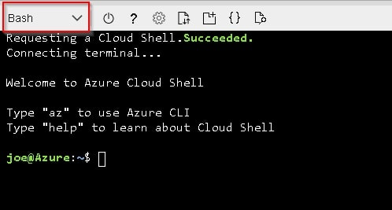
*Launch bash cloud shell*

#### Set up Virtual Environment
Create Virtual Environment with below command.

```bash
# Bash
virtualenv -p /usr/bin/python2.7 databrickscli
```
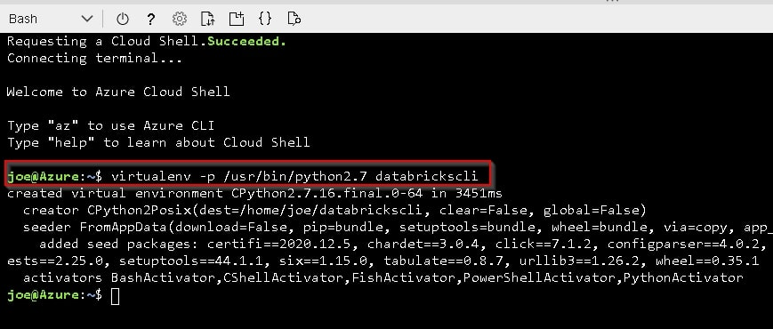
*Create virtual environment*

#### Activate your virtual environment

Activate your virtual environment with below command.

```bash
# Bash
source databrickscli/bin/activate
```

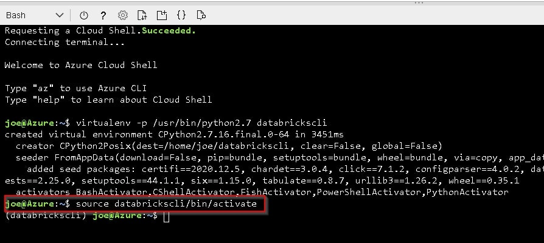
*Activate virtual environment*

#### Install Databricks CLI
Install Databricks CLI with below command.

```bash
# Bash
pip install databricks-cli
```

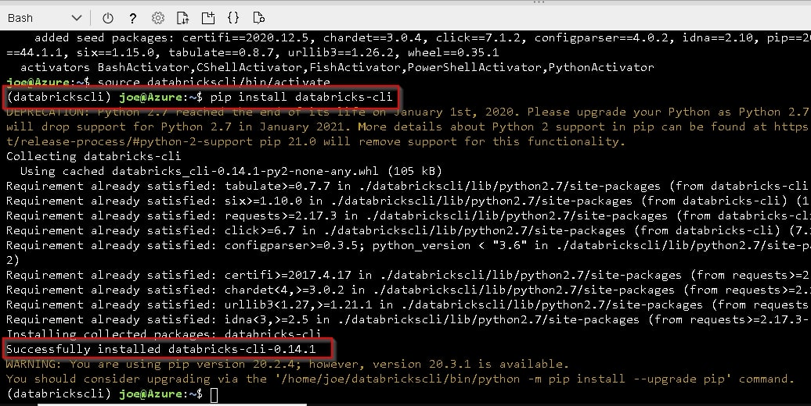
*Install Databricks CLI*

### Create secret in Azure Databricks

#### Set up authentication
Before you can create a secret, you need to authenticate as a user of the Azure Databricks, which requires your Azure Databrics workspace’s URL and a token

##### Get your Azure Databricks workspace’s URL
You can navigate to your Azure Databricks workspace and copy its URL.

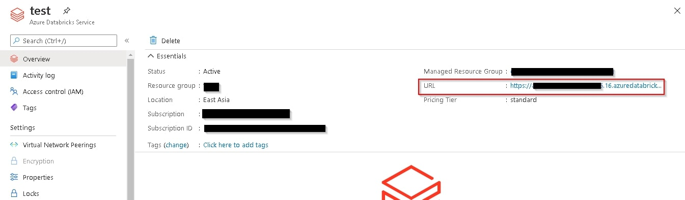
*Get Databricks URL*

##### Generate Access Token for your Azure Databricks workspace
You can follow below steps to retrieve access token

1. Launch Databricks workspace
    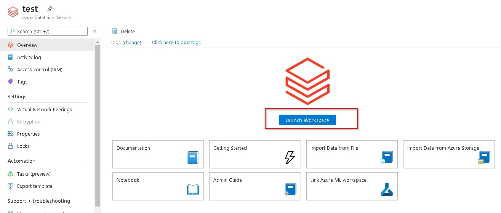
2. Click 'User Settings'
    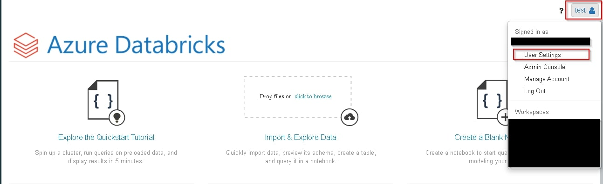
3. Click 'Generate New Token'
    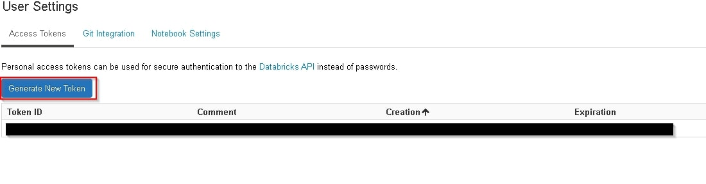
4. Configure access token & click 'Generate'
    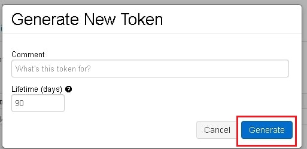
5. Copy access token
    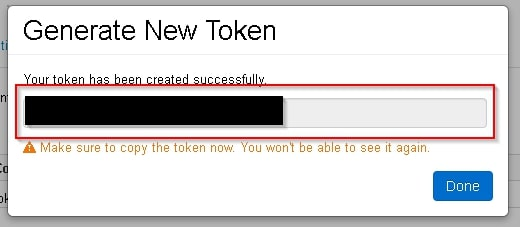


#### Create Secret Scope
After authentication, you need to first create a secret scope which you may group several secrets. 

If your databricks is in Standard plan, you can only create secret scope which will be shared with other users in the same workspace.

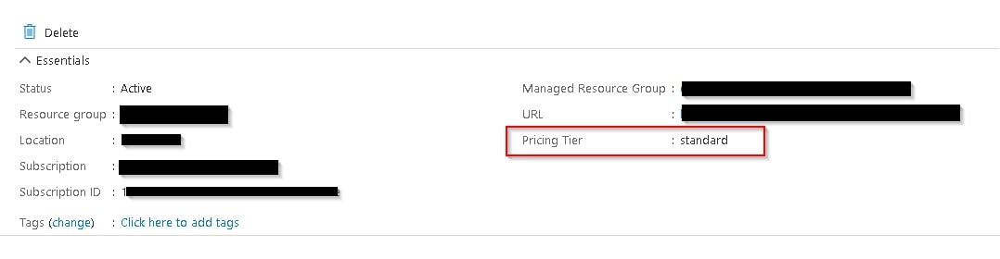
*Check databricks plan*

```bash
# Bash
databricks secrets create-scope --scope <<scope>>

Example: 
databricks secrets create-scope --scope storage --initial-manage-principal users # Standard Plan
databricks secrets create-scope --scope storage # Premium plan
```

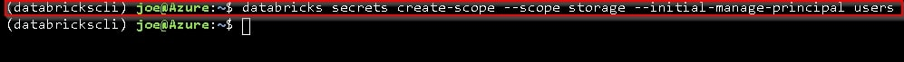
*Create secret scope*

#### Create Secret
You can use below command to create secret under the specified scope.
```bash
# Bash
databricks secrets put --scope <<scope>> --key <<key name>>

Example: databricks secrets put --scope storage --key blob
```

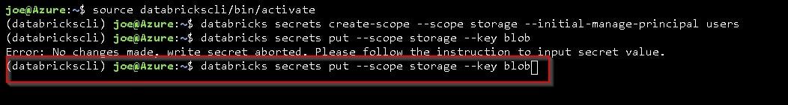
*Type command to launch secret editor*

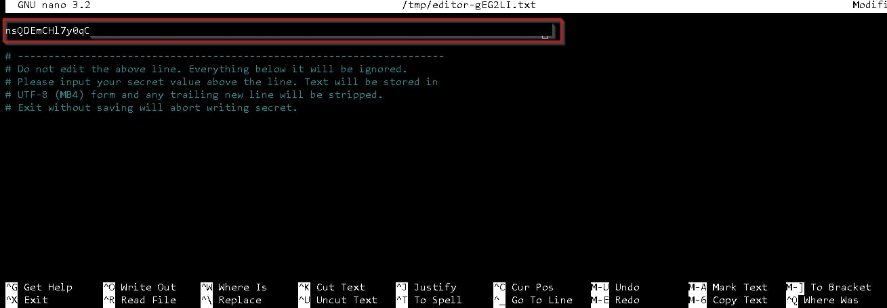
*Type your secret and save*

#### Use Secret in Notebook
You can use secret by below command in notebook.

```python
# Python
dbutils.secrets.get(scope=<<scope>>,key=<<key>>)

Example: dbutils.secrets.get(scope=storage,key=blob)
```

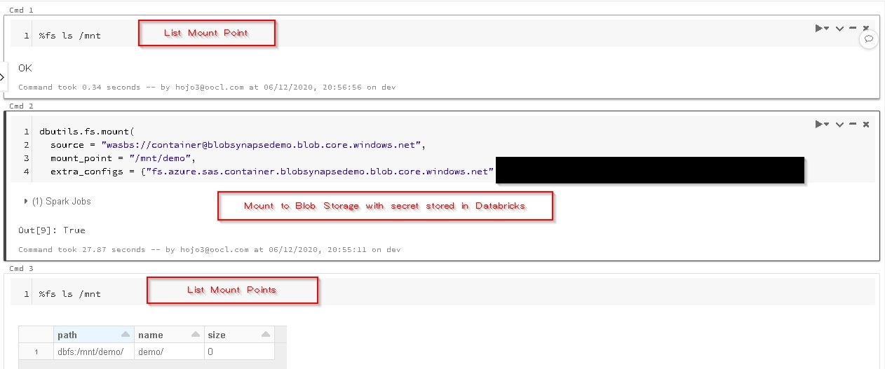
*Use stored secret in notebook*

Blog: [https://joeho.xyz](https://joeho.xyz)

LinkedIn: [https://www.linkedin.com/in/joe-ho-0260758a](https://www.linkedin.com/in/joe-ho-0260758a)
