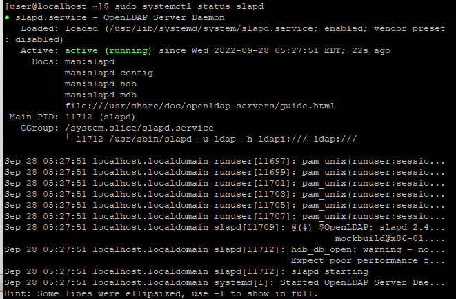

LDAP, Lightweight Directory Access Protocol is a directory service for us to manage identities and objects easily. One of the most common application is that you can authenticate to a server with LDAP. In Windows world, the server is usually Active Directory. In Linux world, OpenLDAP is widely adopted.

In this guide, I will show you how to install and configure a simple workable LDAP server.

## Concept
Before diving into the installation and configuration, it's better to know some terms used in LDAP.

### Attribute
An attribute is a characteristic of an object. For example, an email of an account.

### Object Class
An object class defines what attributes that object can have. For example, we define an object class, InetOrgPerson, it may contain displayName and mail **attributes**. Depends on the definition of object class, the attributes specified can be mandatory or optional.

### Distinguished Name (DN)
Distinguished Name lets us uniquely identify the object. It is similar to the file path in a reverse order. For example, **uid=joeho,OU=People,DC=abc,DC=local** is a **DN**

### Entry
An entry is just an object. You define what object class this entry belongs to & each object class defines what attributes this object has. Each entry can belong to multiple object classes and need to have all mandatory attributes specified in all object classes it belongs to.

### Schema
A schema contains the definitions of various attributes and object classes.

### Domain Component (DC) & Organizational Unit (OU)
They are containers, contains object & let you manage objects in a hierarchy manner. People use them commonly.

## OpenLDAP Installation
Install OpenLDAP related packages
```bash
sudo yum install openldap* -y
sudo systemctl start slapd
sudo systemctl enable slapd
sudo systemctl status slapd # Check service is started & enabled
```

## OpenLDAP Configuration
Generate OpenLDAP password and save it
```bash
sudo slappasswd
```

Then, we will use ldapmodify to update **/etc/openldap/slapd.d/cn=config/olcDatabase={2}hdb.ldif**, which is our database config file

We will create a file & customize and paste content below
```bash
vi db.ldif
```
Content you should paste:
You should replace with your customized values
1. olcSuffix (should be replaced by your domain, e.g. example.com -> dc=example,dc=com)
2. olcRootDN (should be replaced by your domain admin name, can be any name you prefer, e.g. admin -> cn=admin,dc=abc,dc=local)
3. olcRootPW (should be the password you generate above)

```bash
dn: olcDatabase={2}hdb,cn=config
changetype: modify
replace: olcSuffix
olcSuffix: dc=abc,dc=local

dn: olcDatabase={2}hdb,cn=config
changetype: modify
replace: olcRootDN
olcRootDN: cn=admin,dc=abc,dc=local

dn: olcDatabase={2}hdb,cn=config
changetype: modify
replace: olcRootPW
olcRootPW: {SSHA}xxxxx
```


Run this command to update.
```bash
sudo ldapmodify -Y External -H ldapi:/// -f db.ldif
```
Configuration of **/etc/openldap/slapd.d/cn=config/olcDatabase={2}hdb.ldif** should change


Apply some [commonly used schema](https://www.openldap.org/doc/admin24/schema.html#:~:text=13.1.-,Distributed%20Schema%20Files,-OpenLDAP%20Software%20is). The 2nd & 3rd schema allow us to create an object with InetOrgPerson & ShadowAccount which we will use to create an user
```bash
sudo ldapadd -Y EXTERNAL -H ldapi:/// -f /etc/openldap/schema/cosine.ldif
sudo ldapadd -Y EXTERNAL -H ldapi:/// -f /etc/openldap/schema/nis.ldif
sudo ldapadd -Y EXTERNAL -H ldapi:/// -f /etc/openldap/schema/inetorgperson.ldif
```
## OpenLDAP Verification
### Create objects, Organizational Unit and group
Create a file, **entries.ldif**, and add below content which 
1. create a user, joe
2. assign joe to 2 groups, joe & Engineering

```
dn: dc=abc,dc=local
dc: abc
objectClass: top
objectClass: domain

dn: ou=People,dc=abc,dc=local
objectClass: organizationalUnit
ou: People

dn: ou=Groups,dc=abc,dc=local
objectClass: organizationalUnit
ou: Groups

dn: cn=Engineering,ou=Groups,dc=abc,dc=local
cn: Engineering
objectClass: posixGroup
gidNumber: 20100
memberUid: joe

dn: uid=joe,ou=People,dc=abc,dc=local
objectClass: inetOrgPerson
objectClass: posixAccount
objectClass: shadowAccount
uid: joe
sn: Ho
givenName: Joe
cn: Joe Ho
displayName: Joe Ho
uidNumber: 20001
gidNumber: 20001
loginShell: /bin/bash
homeDirectory: /home/joe
shadowMin: 0
shadowMax: 2
shadowWarning: 1
userPassword: {CRYPT}x
shadowLastChange: 19261
dn: cn=joe,ou=Groups,dc=abc,dc=local
cn: joe
objectClass: posixGroup
gidNumber: 20001
memberUid: joe
```

Apply the content

```bash
ldapadd -x -W -D "cn=admin,dc=abc,dc=local" -f entries.ldif
```
### Test querying LDAP
Query all entries
```
ldapsearch -D cn="admin,dc=abc,dc=local" -W -b "dc=abc,dc=local"
```


### Change account password (Optional)
The account we created above uses a password, **{CRYPT}x**, which we obviously don't want it to be, so we change the password as below
```bash
sudo ldappasswd -x -D cn=admin,dc=abc,dc=local -W -S uid=joe,ou=People,dc=abc,dc=local
```


### Configure Access Control List (ACL) (Optional)
In the future, we may want the users to manage the password themselves, so we create an ACL to let the account owner to do so.

Create ACL configuration file
```bash
cat > auth_acl.ldif << EOF
dn: olcDatabase={2}hdb,cn=config
changetype: modify
replace: olcAccess
olcAccess: {0}to attrs=userPassword by self write by anonymous auth by * none
olcAccess: {1}to attrs=shadowLastChange by self write by * read
olcAccess: {2}to * by * read
EOF

sudo ldapadd -Y EXTERNAL -H ldapi:/// -f auth_acl.ldif # Apply ACL

sudo ldapsearch -Q -LLL -Y EXTERNAL -H ldapi:/// -b olcDatabase={2}hdb,cn=config '(olcAccess=*)' olcAccess olcSuffix # Verify ACL
```

Test password change
```bash
sudo ldappasswd -x -D uid=joe,ou=People,dc=abc,dc=local -W -S uid=joe,ou=People,dc=abc,dc=local
```


## Conclusion
We complete the whole set up and are able to create users and manage them in LDAP

Blog: [https://joeho.xyz](https://joeho.xyz)

LinkedIn: [https://www.linkedin.com/in/ho-cho-tai-0260758a](https://www.linkedin.com/in/ho-cho-tai-0260758a)