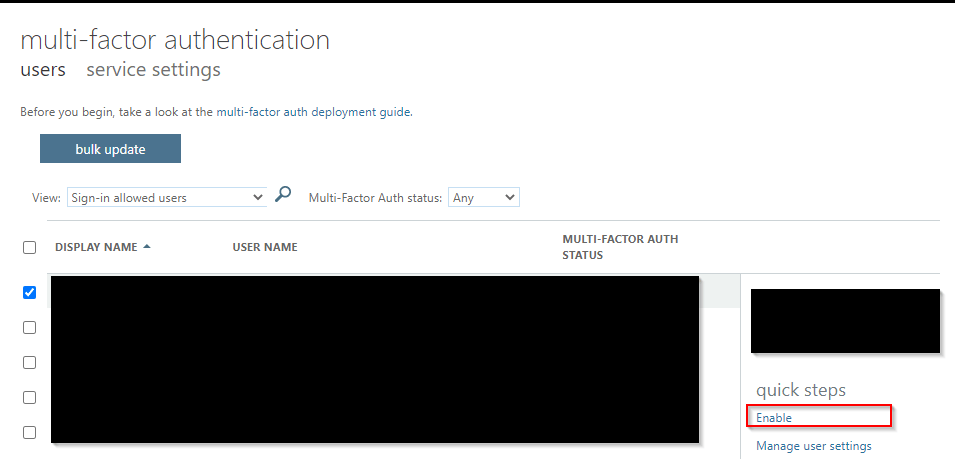
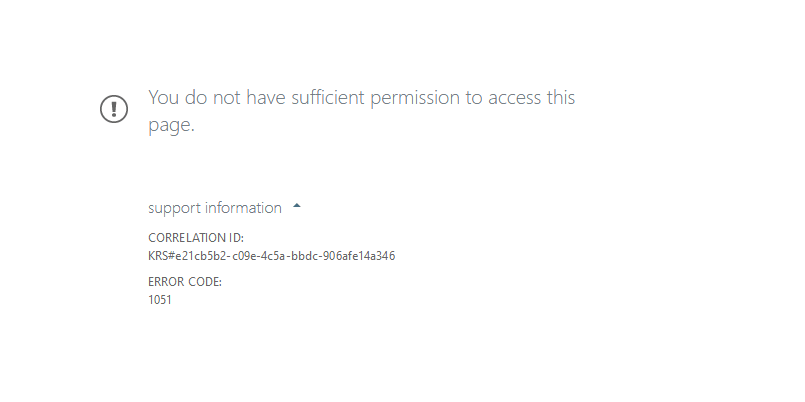
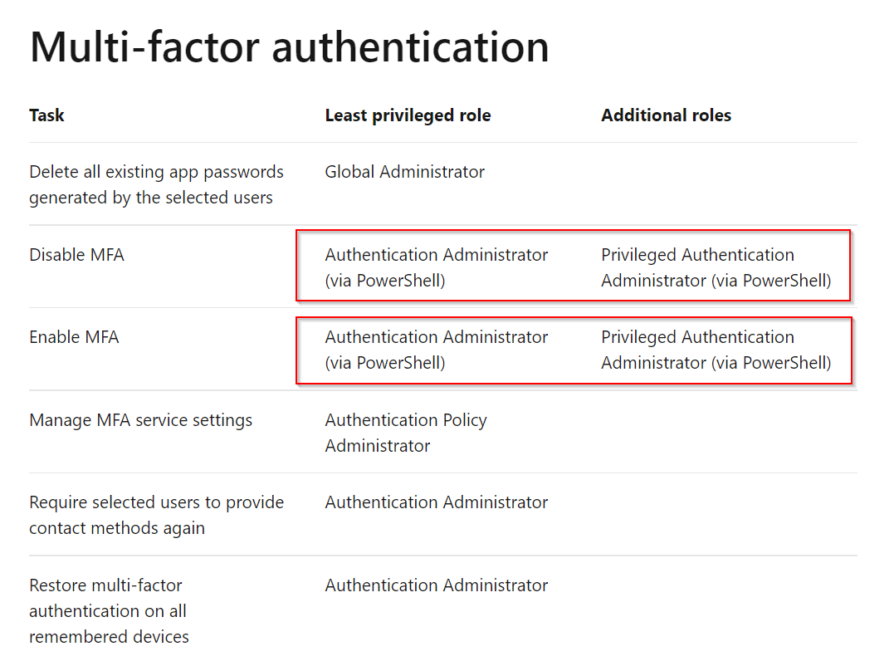
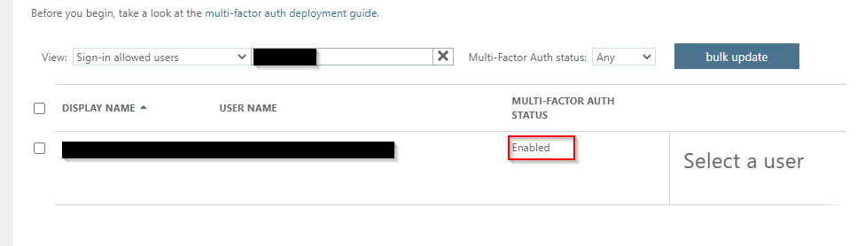
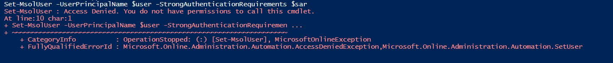
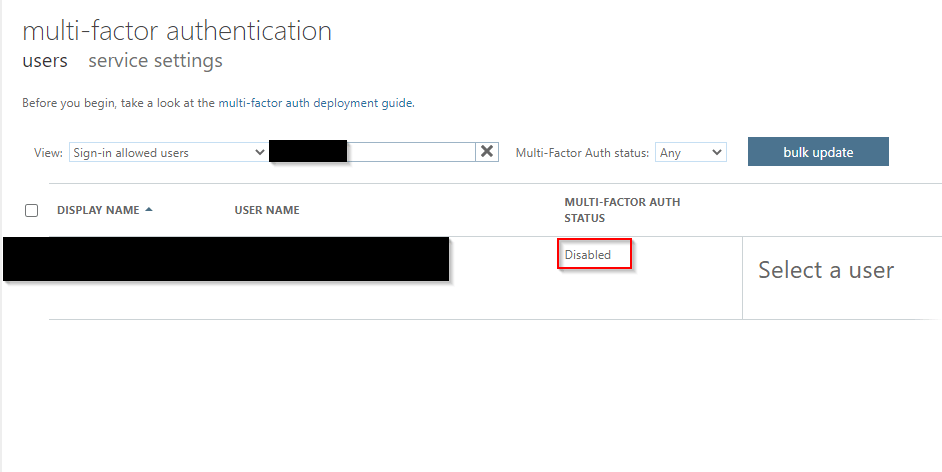
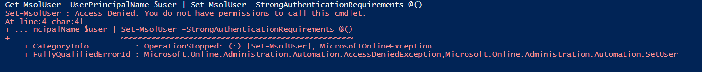

## Background
With MFA (Multi-Factor Authentication) enabled by default in Azure AD (Active Directory) , there are always some situations we need to disable/re-enable MFA for some users. These tasks are easy and repetitive, but we hesitate to let helpdesk to handle it or automate it, as MFA management used to require Global Administrator, the greatest privilege in Azure AD.

Recently, Microsoft announced two new roles, Authentication Administrator and Privileged Authentication Administrator, which we can use them to manage MFA per user.

## Role Overview
Authentication Administrator and Privileged Authentication Administrator are Azure AD built in roles, both of them are meant to manage authentication method, including MFA. 

The main difference between these roles is that ONLY Privileged Authentication Administrator can manage authentication (including MFA) for administrator account. For general users, these two roles are the same.

Per test, these two types of adminstrator cannot manage MFA per user in Microsoft Admin Portal/Azure AD Portal. However, it is doable to manage MFA per user in PowerShell


*Normal MFA Management Console*


*Access denied when accessing MFA Management Console*

## PowerShell Demostration
Despite the limitation in Admin Portal, actually we can still manage MFA via PowerShell according to Microsoft’ document.


*Microsoft Document about using PowerShell as Authentication Administrator and Privileged Authentication*

### View MFA Status of all users

Export MFA Status of all users in grid view via PowerShell, it applies to Authentication Administrator or Privileged Authentication Administrator role.

```powershell
Write-Host "Finding Azure Active Directory Accounts..."
$Users = Get-MsolUser -All | ? { $_.UserType -ne "Guest" }
$Report = [System.Collections.Generic.List[Object]]::new() # Create output file
Write-Host "Processing" $Users.Count "accounts..." 
ForEach ($User in $Users) {
    $MFAMethods = $User.StrongAuthenticationMethods.MethodType
    $MFAEnforced = $User.StrongAuthenticationRequirements.State
    $MFAPhone = $User.StrongAuthenticationUserDetails.PhoneNumber
    $DefaultMFAMethod = ($User.StrongAuthenticationMethods | ? { $_.IsDefault -eq "True" }).MethodType
    If (($MFAEnforced -eq "Enforced") -or ($MFAEnforced -eq "Enabled")) {
        Switch ($DefaultMFAMethod) {
            "OneWaySMS" { $MethodUsed = "One-way SMS" }
            "TwoWayVoiceMobile" { $MethodUsed = "Phone call verification" }
            "PhoneAppOTP" { $MethodUsed = "Hardware token or authenticator app" }
            "PhoneAppNotification" { $MethodUsed = "Authenticator app" }
        }
    }
    Else {
        $MFAEnforced = "Not Enabled"
        $MethodUsed = "MFA Not Used" 
    }
  
    $ReportLine = [PSCustomObject] @{
        User        = $User.UserPrincipalName
        Name        = $User.DisplayName
        MFAUsed     = $MFAEnforced
        MFAMethod   = $MethodUsed 
        PhoneNumber = $MFAPhone
    }
                 
    $Report.Add($ReportLine) 
}

Write-Host "Creating report…"
$Report | Select Name, MFAUsed, MFAMethod, PhoneNumber | Sort Name | Out-GridView
```

### Enable MFA for a user

Enable MFA for a specific user via PowerShell. You can only enable MFA for admin account (e.g. Global Admin) as Privileged Authentication Administrator

```powershell
# Create the StrongAuthenticationRequirement Object
$sa = New-Object -TypeName Microsoft.Online.Administration.StrongAuthenticationRequirement
$sa.RelyingParty = "*"
$sa.State = "Enabled"
$sar = @($sa)

# Enable MFA for the user
Connect-MsolService
$user = <<User UPN>>
Set-MsolUser -UserPrincipalName $user -StrongAuthenticationRequirements $sar
```


*MFA enabled for general user*


*Access denied while enabling MFA for admin account as Authentication Administrator*

### Disable MFA for a user

Disable MFA for a specific user via PowerShell. You can only enable MFA for admin account (e.g. Global Admin) as Privileged Authentication Administrator


```powershell
Connect-MsolService

$user = <<User UPN>>
Get-MsolUser -UserPrincipalName $user | Set-MsolUser -StrongAuthenticationRequirements @()
```


*MFA disabled for general user*


*Access denied while disabling MFA for admin account as Authentication Administrator*

Blog: [https://joeho.xyz](https://joeho.xyz)

LinkedIn: [https://www.linkedin.com/in/ho-cho-tai-0260758a](https://www.linkedin.com/in/ho-cho-tai-0260758a)

Reference:

Original PowerShell scripts come from [https://lazyadmin.nl/powershell/powershell-enable-mfa-for-office-365-users/](https://lazyadmin.nl/powershell/powershell-enable-mfa-for-office-365-users/ "https://lazyadmin.nl/powershell/powershell-enable-mfa-for-office-365-users/")
