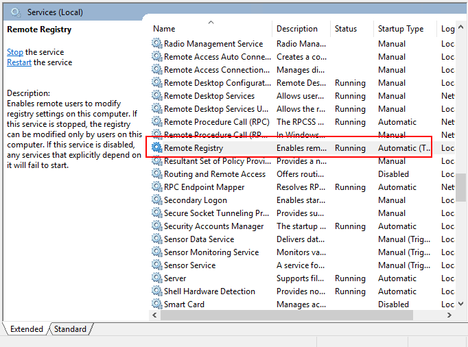
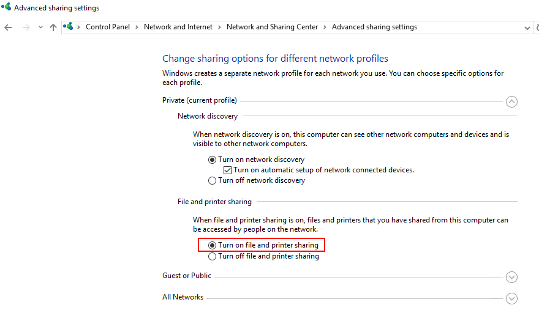
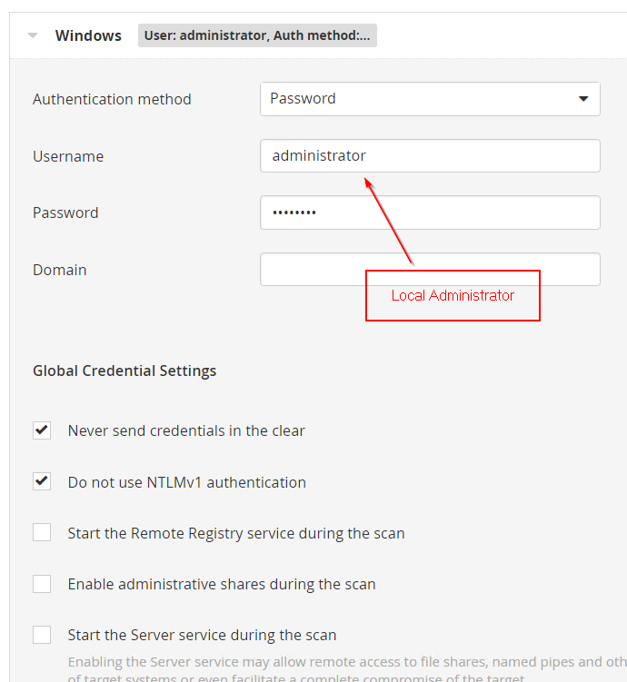
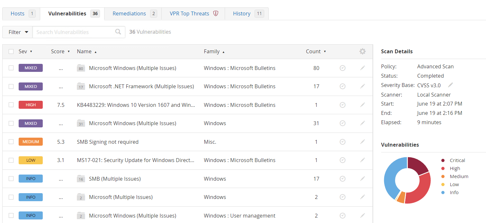
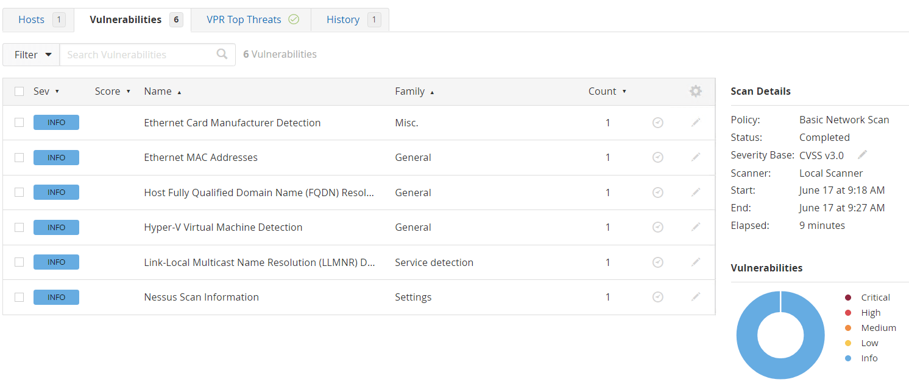

Nessus scanner is a popular vulnerability scanning tool to discover outdated softwares and missing security patches on Windows & linux. Credential scanning is to scan machine with privilege account, typically local administrator of the machine. In Nessus, you can choose external scanning or credential scanning. The former one only provides you some basic information about the machiens, e.g. open port. Only if you choose credential scanning, you can find vulnerable softwares and missing patches. 

## Start remote registry service
Remote registry service is a Windows feature to view and modify registry. You need to start it on target machine to allow Nessus to perform scanning.

*Start remote registry service*

## Enable file and printer sharing
With file and printer sharring, machines in the same network can access your machine. You need to enable it on target machine such that Nessus can access the file.

*Enable file and printer sharing*

## Configure credential scanning in Nessus
Fill in credentials of your local administrator of the target machine, then you can do scanning.

*Configure credential scanning in Nessus*

Scanning Result:

*Vulnerabilities found in credential scanning*

As comparison, vulnerabilites found in external scanning are much fewer.

*Vulnerabilities found in external scanning*

## Conclusion
By using Nessus credential scanning, we can find vulnerable softwares and missing patches in Windows machine.

*Other articles you may be interested:*
1. [Vulnerability Scanning with MDATP](/blog-posts/vulnerability-scanning-in-microsoft-defender-for-server/)