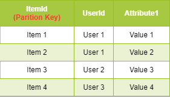
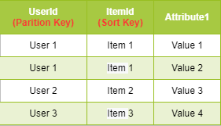
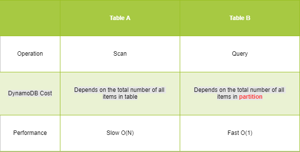

## Background
AWS DynamoDB is a key-values database, every item in DynamoDB is associated an unique primary key which is required in almost all DynamoDB's APIs, so having a good design on this primary key is crucial for your development.

## What's primary key in DynamoDB
A primary key is used to identity an item in DynamoDB uniquely. In general, there are two types of primary key.
1. Constructed by partition key solely (Simple Primary Key)
2. Constructed by partition key and sort key (Composite Key)

Example:

*Dynamodb Primary Key Example*

### Partition Key
DynamoDB uses partition key to partition a table, items having the same partition key will be stored in the same partition. 
Worth mentioning, if your primary key is composed by partition key only, each partition will only have a single item, as all items have different partition key.

*Dynamodb Partition*

Partition key is required in most of the DynamoDB queries, a bad partition key will make DynamoDB access a single partition key frequently (3000 Read or 1000 Write per second), which may causes request throttling.
To avoid that, the partition key should be high cardinality. For example, it can be an uuid or you may combine multiple several low cardinality attributes to generate a high cardinality attrtibue for partition key.

### Sort Key
Sort key does not alter the table like partition key does, it helps you to extend and refine your DynamoDB queries.
For example, you can use sort key to filter items larger than certain thresholds after you retrieve the whole partition with partition key.

One of the limitations in DynamoDB is that, you can only use partition key and sort key for most of DynamoDB queries. In other words, you should set an attribute as a sort key if you anticipate it would be used for queries.
Remark: It is still feasible to filter items in DynamoDB other than partition key and sort key, but it is expensive in terms of price and performance.

There are some use cases for sort key.
1. Consider a note-taking app. You can create a DynamoDB table which uses userId as partition key and noteId as sort key. In this scenario, you can use userId to retrieve all notes of the user and you can also get a specify note by providing userId and noteId.
2. You can also use sort key to define hierarchical relationships. For example, in a table listing geographical locations, sort key can be defined [country]#[region]#[state]#[county]#[city]. In this scenario, you use "begin with" operatior to filter items with specify count, country and region pairs, etc.

## Benefits of proper primary key design
We will provide some examples here to illustrate the benefits of proper primary key design.
Before diving in the comparsion, we need to define the metrics we are goind to measure.
1. DynamoDB Read Cost (you can consider it is proportional to the number items you application reads in DynamoDB table)
2. Performance
3. Development efforts

## Simple Primary Key V.S. Composite Key
We will take below two tables as an example to illustrate the benefits of having sort key.

*Table A: Dynamodb Table without Sort Key*

*Table B: Dynamodb Table with Sort Key*

### Retrieve all items from an user
#### Operation Used
In table A, you need to use "scan" operation to get those items, which basically access every item in the table. In table B, you can use query to access that particular partition.

#### Cost
In table A, the cost for "scan" operation depends on the total number of items in the table, as "scan" opertion will read every item in the table.
In table B, the cost is proportional to the size of partition you are trying to read, as you are reading the partition directly. Therefore, it is much cheaper than "scan" operation.

#### Performance
In table A, you need to search the whole table so that you can retrieve all items of an user, which is O(N).
In contrast, in table B, DynamoDB uses hash of the partition key provided to lookup the corresponding partition, which is in O(1).

#### Summary on Composite Key
In this example, we can see that using Composite Key can help us to query all related items in a partition rather scanning the whole table. 
Usually, composite key is adopted when your table contain some sort of one-to-many relationships high cardinality attributes, i.e. userId and itemId in this example.

*Comparison between Simple Primary Key & Composite Key*

## Conclusion
If your table is small, using partition key solely as the primary key is good enough, because you don't need to spend extra efforts to worry about sort key.
However, it is better to use sort key in your table if you table grows, it can help you extend the capability of DynamoDB query and lower your cost.

Blog: [https://joeho.xyz](https://joeho.xyz)

LinkedIn: [https://www.linkedin.com/in/joe-ho-0260758a](https://www.linkedin.com/in/joe-ho-0260758a)