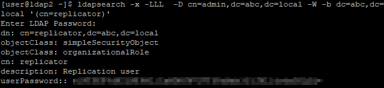
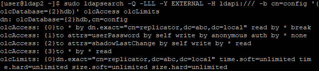
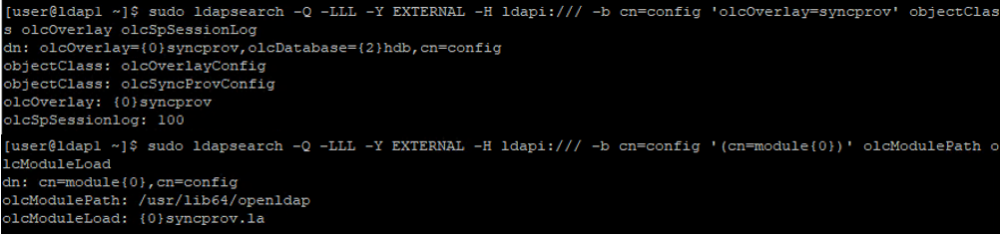
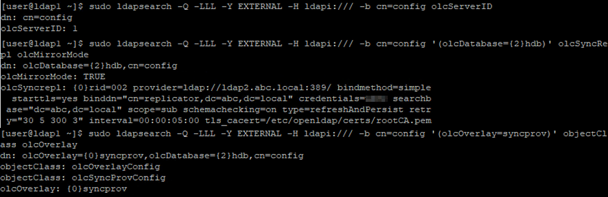
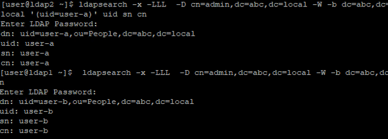

OpenLDAP plays an important role in enterprise computing environments. It makes sense to have multiple LDAP servers to achieve high availability and better performance. The former goal is about ensuring that the LDAP service is always up. Clients can failover to other OpenLDAP servers if the server they were communicating with goes down. The latter goal is about distributing OpenLDAP servers in different regions. This allows clients in each region to communicate with nearby OpenLDAP servers, which reduces network latency and improves performance.

If you want to have multiple OpenLDAP servers, the first issue you need to solve is synchronization between them. You need to ensure that the directory data in each server is the same and that any data updated in one OpenLDAP server will be propagated to other OpenLDAP servers as well. Inconsistencies in the data can cause authentication failures and improper identity handling.

In this guide, I will share how to set up master-master replication for OpenLDAP on CentOS 7.

## Concepts
Regarding OpenLDAP directory information data replication, each OpenLDAP server can play the role of provider and/or consumer. When acting as a provider, the counterpart consumer will pull the directory data from you. It's worth mentioning that a server can act as both provider and consumer, meaning it can replicate data from other OpenLDAP servers as a consumer, and any changes made to that server will be propagated to other OpenLDAP servers as a provider.

In general, OpenLDAP replication can be achieved using a master-slave model or a master-master model. In the master-slave model, there is only one provider, and the other LDAP servers are consumers. You can only update the directory information in the provider. In the master-master model, each server is a provider and consumer, and you can update any of them.

## Configuration
In the setup below, we assume you have two OpenLDAP servers, LDAP1 and LDAP2. The configuration provided is for LDAP1 only, so you will need to repeat it for LDAP2 in order for them to perform master-master replication.

### OpenLDAP replication service account and access control lists (ACL)
You can create a service account for OpenLDAP server to pull the data from another OpenLDAP server

Create a service account on LDAP2 server.
```bash
# Specify replicator attributes
cat > replicator.ldif << EOF
dn: cn=replicator,dc=abc,dc=local
objectClass: simpleSecurityObject
objectClass: organizationalRole
cn: replicator
description: Replication user
userPassword: {CRYPT}x
EOF

# Create the replication service account
ldapadd -x -ZZ -D cn=admin,dc=abc,dc=local -W -f replicator.ldif

# Change replication service account password
ldappasswd -x -D cn=admin,dc=abc,dc=local -W -S cn=replicator,dc=abc,dc=local
```


Configure ACL to allow this service account to access all directory information with no search limit
```bash
# Update ACL and search limit
cat > replicator-acl-limits.ldif << EOF
dn: olcDatabase={2}hdb,cn=config
changetype: modify
add: olcAccess
olcAccess: {0}to *
  by dn.exact="cn=replicator,dc=abc,dc=local" read
  by * break
-
add: olcLimits
olcLimits: dn.exact="cn=replicator,dc=abc,dc=local"
  time.soft=unlimited time.hard=unlimited
  size.soft=unlimited size.hard=unlimited
EOF

# Apply ACL & search limit configuration
sudo ldapmodify -Y EXTERNAL -H ldapi:/// -f replicator-acl-limits.ldif
```


### Provider Configuration
Enable & configure syncprov module on LDAP1 server
```bash
# Enable syncprov module
cat > syncprov_module.ldif << EOF
dn: cn=module,cn=config
objectClass: olcModuleList
cn: module
olcModulePath: /usr/lib64/openldap
olcModuleLoad: syncprov.la
EOF

sudo ldapadd -Y EXTERNAL -H ldapi:/// -f syncprov_module.ldif

# Configure syncprov module
cat > syncprov.ldif << EOF
dn: olcOverlay=syncprov,olcDatabase={2}hdb,cn=config
objectClass: olcOverlayConfig
objectClass: olcSyncProvConfig
olcOverlay: syncprov
olcSpSessionLog: 100
EOF

sudo ldapadd -Y EXTERNAL -H ldapi:/// -f syncprov.ldif
```


### Consumer Configuration
Regarding consumer configuration on LDAP1 server, you need to specify
1. **olcServerID**, global unique ID among all OpenLDAP servers
2. **rid**. local unique ID for each provider within the configuration file
3. **provider**, OpenLDAP server you want to replicate data from
4. **binddn**, the account you use to pull data from another OpenLDAP server
5. **credentials**, the password of the account specified in 2
6. **searchbase**, usually the domain you want to replicate from
7. **starttls**, specify it if your provider use StartTLS, something as we mentioned [before](/blog-posts/configure-starttls-to-encrypt-openldap-connection-on-centos7/)
8. **tls_cacert**, CA cert for StartTLS

```bash
# Consumer configuration
cat > ldap1.ldif << EOF
# create new
dn: cn=config
changetype: modify
replace: olcServerID
# specify unique ID number on each server
olcServerID: 1

dn: olcDatabase={2}hdb,cn=config
changetype: modify
add: olcSyncRepl
olcSyncRepl: rid=002
  provider=ldap://ldap2.abc.local:389/
  bindmethod=simple
  starttls=yes
  binddn="cn=rid,dc=abc,dc=local"
  credentials=<<your-service-account-password>>
  searchbase="dc=abc,dc=local"
  scope=sub
  schemachecking=on
  type=refreshAndPersist
  retry="30 5 300 3"
  interval=00:00:05:00
  tls_cacert=/etc/openldap/certs/rootCA.pem
-
add: olcMirrorMode
olcMirrorMode: TRUE

dn: olcOverlay=syncprov,olcDatabase={2}hdb,cn=config
changetype: add
objectClass: olcOverlayConfig
objectClass: olcSyncProvConfig
olcOverlay: syncprov
EOF

sudo sudo ldapadd -Y EXTERNAL -H ldapi:/// -f ldap1.ldif
```


## OpenLDAP master-master replication verification
Create an user on LDAP1 server

```bash
# Specify user-a attributes
cat > create_user-a.ldif << EOF
dn: uid=user-a,ou=People,dc=abc,dc=local
objectClass: inetOrgPerson
objectClass: posixAccount
objectClass: shadowAccount
uid: user-a
sn: user-a
givenName: user-a
cn: user-a
displayName: user-a
uidNumber: 80001
gidNumber: 8001
userPassword: {CRYPT}x
gecos: user-a
loginShell: /bin/bash
homeDirectory: /home/user-a
EOF

# Create user-a
ldapadd -x -D cn=admin,dc=abc,dc=local -W -f create_user-a.ldif
```

Create an user on LDAP2 server
```bash
cat > create_user-a.ldif << EOF
dn: uid=user-b,ou=People,dc=abc,dc=local
objectClass: inetOrgPerson
objectClass: posixAccount
objectClass: shadowAccount
uid: user-b
sn: user-b
givenName: user-b
cn: user-b
displayName: user-b
uidNumber: 80002
gidNumber: 8002
userPassword: {CRYPT}x
gecos: user-b
loginShell: /bin/bash
homeDirectory: /home/user-b
EOF

# Create user-b
ldapadd -x -D cn=admin,dc=abc,dc=local -W -f create_user-b.ldif
```

Search the users
```bash
# Run on LDAP2
ldapsearch -x -LLL  -D cn=admin,dc=abc,dc=local -W -b dc=abc,dc=local '(uid=user-a)' uid sn cn
# Run on LDAP1
ldapsearch -x -LLL  -D cn=admin,dc=abc,dc=local -W -b dc=abc,dc=local '(uid=user-b)' uid sn cn
```


## Conclusion
In this guide, we discuss the benefits of having multiple OpenLDAP servers and provide a guide for synchronizing them using master-master replication, which ensures that any update made on one server will be propagated to all other servers.

Blog: [https://joeho.xyz](https://joeho.xyz)

LinkedIn: [https://www.linkedin.com/in/ho-cho-tai-0260758a](https://www.linkedin.com/in/ho-cho-tai-0260758a)