Microsoft Defender For Server is one of the features of Microsoft Defender For Cloud, it aims to protect your servers on cloud, one of the features it provides is to discover vulnerabilities in software installed in your servers. In this article, we will cover the compatibility, types of vulnerability scanners, installation and how to view these vulnerabilities.

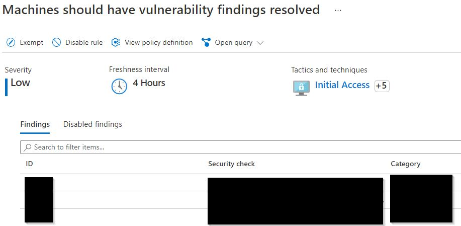
*View all vulnerabilities detected by Microsoft Defender For Server*

## Compatibility
Microsoft Defender For Server applies to mainstream operating systems of servers that are created by us explicitly. 
In other words, Servers that are created by other Azure services, e.g. servers from Azure Kubernetes Service, servers from Azure Databricks.

## Types of vulnerability scanners
For Microsoft Defender For Servers, Microsoft offers 2 types of vulnerability scanners, one is from Qualys, another one is developed by Microsoft.

After the evaluation, I think that the one developed by Microsoft is better and discuss about this scanner in the rest of this article. 

There are 2 areas that Microsoft scanner outperforms Qualys’s scanner.

First, Microsoft’s scanner detects vulnerabilities in [real-time](https://docs.microsoft.com/en-us/microsoft-365/security/defender-endpoint/next-gen-threat-and-vuln-mgt?view=o365-worldwide#:~:text=Discover%20vulnerabilities%20and%20misconfigurations%20in%20real%20time) while Qualys’s scanner scan our machines every [4 hours](https://techcommunity.microsoft.com/t5/microsoft-defender-for-cloud/built-in-vulnerability-assessment-for-vms-in-microsoft-defender/ba-p/1577947#:~:text=Such%20scans%20occur-,every%204%20hours,-and%20are%20performed). 

Second, Microsoft’s scanner discovers non-patchable vulnerabilities while Qualys’s scanner doesn’t.

## Installation

### Prerequisite
To enable the vulnerability scanning in Microsoft Defender For Server, you need to install Microsoft Defender For Endpoint (MDE) which is a endpoint detection and response solution (EDR) that comes with Microsoft Defender For Server. In other words, you need to ensure your machines are shown as "healthy" regarding the recommendation, "Endpoint protection should be installed on machines".

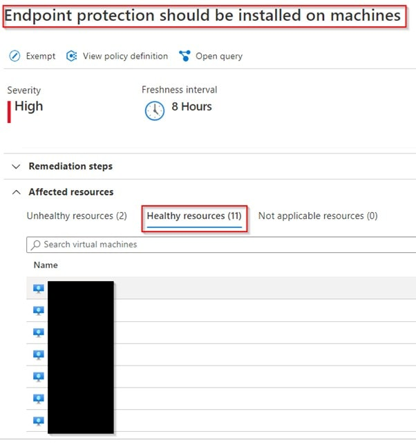
*Check MDE status of servers*

### Installation Steps
First, navigate to "Machines should have a vulnerability assessment solution" recommendation. It checks whether vulnerability scanning is enabled for your machines or not.

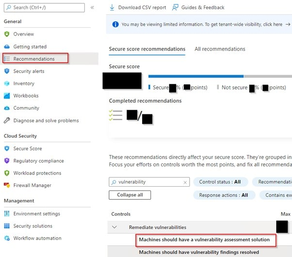
*Navigate to "Machines should have a vulnerability assessment solution" recommendation*

Second, pick a machine which doesn’t install MDE to proceed the installation & click "fix" button at the bottom.

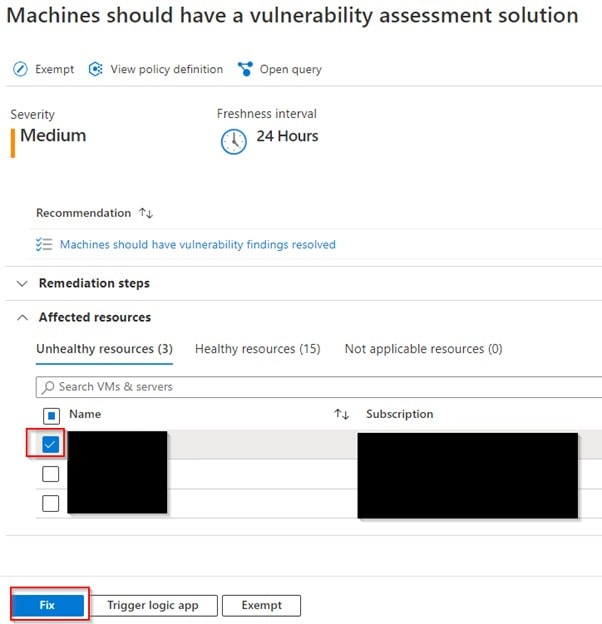
*Check vulnerability scanning deployment status*


Third, choose the preferred scanner. The first 2 scanners come with Microsoft Defender For Server with no extra cost. The comparison between these 2 scanners is in next section.

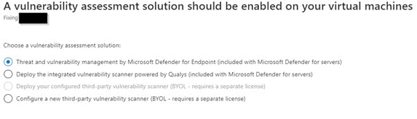
*Choose vulenrability scanner & deploy it*

## View the vulnerabilities

### View the vulnerabilities In Microsoft Defender For Cloud Portal
After the installation, the scanners will detect the vulnerabilities in your servers. You can view these vulnerabilities in the Microsoft Defender For Cloud Portal.

Navigate to “Machines should have vulnerability findings resolved” recommendation. It shows all vulnerabilities in your servers.
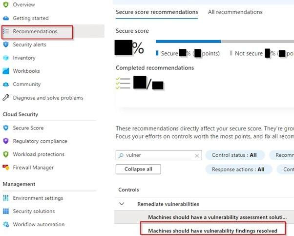
*Navigate to "Machines should have vulnerability findings resolved*

Then, you can see all machines that have vulnerabilities & suggestions for patching corresponding vulnerabilities.
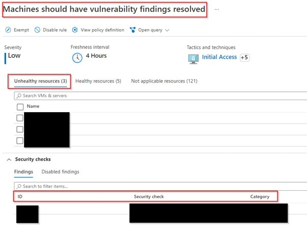
*Check all patching suggestions*

For each suggestion, you can see the vulnerabilities associated to it, i.e. the CVEs & corresponding CVSS scores.
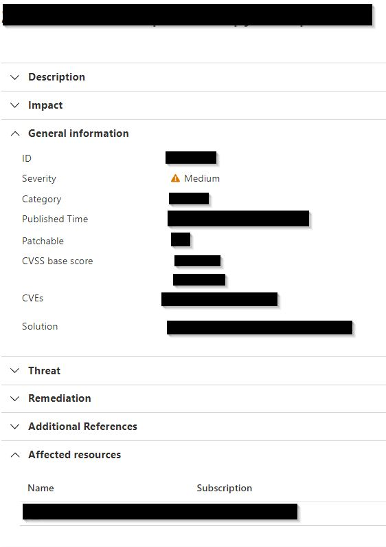
*Detail of patching suggestion*

Although it is pretty GUI to view all vulnerabilities, it hides lots of information that are also detected by the scanners, e.g. whether the vulnerability is public exploitable, whether the vulnerability is used in public exploitable kit.

### View the vulnerabilities In Azure Resource Graph Explorer
By clicking “Query returning security findings”, you can navigate to Azure Resource Graph Explorer, it will show you all vulnerabilities.
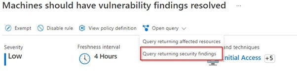
*Navigate to Azure Resource Graph Explorer*

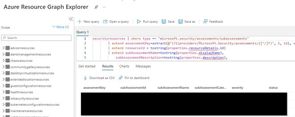
*View all patching suggestions in Azure Resource Graph Explorer*

Here, you can see when the vulnerability is detected. Also, you can see detail of each vulnerability which are important for you to prioritize the patching.
1.	Is the vulnerability zero-day or not?
2.	Is the vulnerability public exploitable?
3.	Is the vulnerability being used in public exploitable kit?

Here’s a query I created to expand all vulnerabilities & get all relevant information.

```sql
securityresources 
| where type =~ "microsoft.security/assessments/subassessments"
| extend assessmentKey=extract(@"(?i)providers/Microsoft.Security/assessments/([^/]*)", 1, id), subAssessmentId=tostring(properties.id), parentResourceId= extract("(.+)/providers/Microsoft.Security", 1, id), additionalData=tostring(properties.additionalData), status=tostring(properties.status.code)
| where assessmentKey == "1195afff-c881-495e-9bc5-1486211ae03f"
| where status == "Unhealthy"
| extend resourceId = tostring(properties.resourceDetails.id)
| extend subAssessmentName=tostring(properties.displayName), severity=tostring(properties.status.severity), timeGenerated=tostring(properties.timeGenerated)
| project subscriptionId, resourceGroup, resourceId,Recommendation=subAssessmentName, properties
| extend cve=properties.additionalData.cve, source=properties.additionalData.source
| project-away properties
| mv-expand cve
| extend CVE=cve["title"], severity=cve.severity, hasPublicExploit=cve.hasPublicExploit, isExploitInKit=cve.isExploitInKit, cvssScore=cve.cvssScore, isZeroDay=cve.isZeroDay, description=cve.description
| where source=="Microsoft threat and vulnerability management"
| extend vm=split(resourceId, "/")[-1]
| project subscriptionId, resourceGroup, vm, CVE, description, severity, cvssScore, hasPublicExploit, isExploitInKit, isZeroDay
```

For the sake of convenience, you can also save this query such that you can open the query next time & use it to query the vulnerability again.

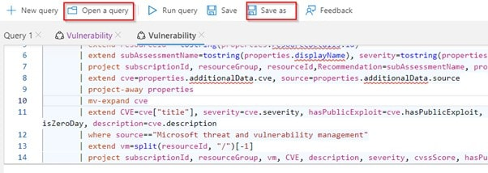
*Save or Open a saved query in Azure Resource Graph Explorer*

## Conclusion
By using Microsoft Defender For Server, we can find all vulnerabilities on all of our servers. With Azure Resource Graph Explorer, we can get more information from the vulnerabilities result.


