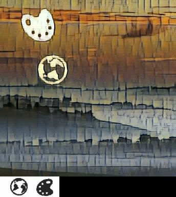
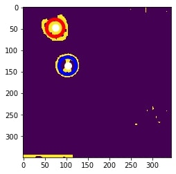

## What is Geetest CAPTCHA?
In today's digital era, about 40% of network traffic is driven by bot. Usually, we only want human access our applications. For example, we want to prevent Ticket Bots for popular concerts. That's why CAPTCHA (Completely Automated Public Turing test to tell Computers and Humans Apart) comes into play, we use it to distinguish Human from bots and thus blocks the bots

Traditional CAPTCHAs typically ask you to recognize the text from a image of printed text under some shape deformations.


*Traditional CAPTCHA*

With technology advance, more bots can solve these CAPTCHAs. Hence, some companies are designing more complicated CAPTCHAs to challenge bots, [Geetest](https://www.geetest.com/) is one of them. Geetest's CAPTCHAs determine if you are human by your answer and how you answer CAPTCHAs (e.g. a human being cannot answer a test in less than 0.01s).

## CAPTCHA Background
The kind of Geetest CAPTCHA I try to solve is as below. 


*CAPTCHA Example*

There are some icons in the CAPTCHA. They may look like what the CAPTCHA asks you to select, or not. You need to select these icons in order specified by the CAPTCHA. On top of that, the solving process should be like a human being solving the CAPTCHA, e.g. if you can solve the CAPTCHA under 0.1 seconds, you will fail in the CAPTCHA.

Here's a Geetest CAPTCHA I am able to crack with image processing and automation technology. In this following sections, I will share how I try to crack the CAPTCHA.


<em class='gif-text' >
Successful Case for cracking CAPTCHA
</em>


Remark: [English CAPTCHA](https://www.geetest.com/en) was available previously, but it is unavailable now. However, [chinese version](https://www.geetest.com/show) of this kind of CAPTCHA is still available, so I will use chinese CAPTCHA in below demonstration section.


*English CAPTCHA*


*Chinese CAPTCHA*

## Technology Stack
1. Selenium (Make our bot behaves like a human being to click the icons in CAPTCHA)
2. OpenCV (Our bot uses it to solve the CAPTCHA through Image Processing and Object Detection)
3. Other Libraries (matplotlib, urllib, numpy, scipy, skimage, time, Pillow)

## Terminology
To explain the solving steps below, a few terms will be used to describe different parts of the CAPTCHA.
1. Main Pane - The area containing several icons and the background
2. Targets - What we going to find in the main pane
3. Target Pane - The area containing all targets


*Green: Icons, Blue: Main Pane, Yellow: Target*

## CAPTCHA Solving Steps
We will take this CAPTCHA as an example.


*CAPTCHA Demo*

### 1. Download the CAPTCHA

To download the CAPTCHA, we just need to download the main pane, as it also contains the targets at the bottom. Main pane belongs to "geetest_item_img" class, you may find it in browser debug console.


*Search 'geetest_item_img' to obtain the geetest CAPTCHA*


*Demo CAPTCHA*

### 2. Remove the background in the main pane 

Background removal can help us improve accuracy, as the bot may recognize some parts of the background as an icon which are false positives.

To remove the background, there are 2 steps.
  
Convert the CAPTCHA into grey scale picture. It can reduce the computation complexity by a factor of 3, as the total number of pixels in a grey scale picture is one-third of that in original CAPTCHA consisting 3 channels (Red, Green and Blue). Besides, it makes background removal easier, we just need to decide a threshold for grey-scale picture instead of total 3 thresholds for Red, Green and Blue channels.

```python
img_grey = cv2.imread(image_path,0) # image_path is the path where the CAPTCHA stored
```

Set a threshold to remove pixels in main_pane which have value larger than that, as these pixels construct the background

```python
# crop image
main_pane = img_grey[:350,:] # Extract the main_pane from the CAPTCHA
color_threshold = 180 # threshold is hard-coded
main_pane = cv2.blur(main_pane,(3,3)) # Adequate blurring can reduce image noise
main_pane[main_pane<color_threshold] = 0
main_pane[main_pane>=color_threshold] = 255	
```


*Remove background in main pane*

Remark: 
Blurring make each pixel being affected by its  surrounding pixels. In this case, some noise (or some pixel has extraordinary higher/lower value) will be "averaged" by the values nearby, thus can be removed.

In terms of mathematics, blurring is to convolve a kernel with an image, which is the same technique used in Convolutional neural network (a kind of state of art in Deep Learning/Artificial Intelligence). You may refer to below materials for more information.

References:
1. [Gaussian blur](https://en.wikipedia.org/wiki/Gaussian_blur)
2. [OpenCV Python Filtering](https://opencv-python-tutroals.readthedocs.io/en/latest/py_tutorials/py_imgproc/py_filtering/py_filtering.html)

### 3. Locate where the icons are in the main pane

The basic idea is to extract the external boundary of each icon, then we can get some "critical" points of that boundary (i.e. the points can form the boundary via joining them with various straight lines.). After that, we can draw the bounding box (a.k.a rectangle) from these points by comparing these points' x and y coordinates, e.g. top left corner of the boundary box is the top left "critical" point

Draw a bounding box for each icon in main pane. It serves two purpose.First, it visualizes the result, thus helps us debug. Second, the bounding boxes provide me the exact coordinates, we can use coordinates to get a patch of area. Then, we can compare the targets with these areas bounded by bounding boxes.

```python
_, contours, hierarchy = cv2.findContours(pane, cv2.RETR_EXTERNAL, cv2.CHAIN_APPROX_SIMPLE) #Calculate the contours. Boundary is the layman term of contour
```

```python
(x, y, w, h) = cv2.boundingRect(contour) #Obtain the coordinates of top left corner (x,y), width and height of a bounding box
```


*Locate icons in the main pane*

### 4.  Locate where the targets at the bottom
Although we know targets are at the bottom of main pane, they are positioned in a row and not in a tidy and proper manner. Hence, we spend some efforts to extract them. Fortunately, We can use the method described in last step to extract them without extra image processing, as the targets are already in black while the background are in white.


*Locate targets at the bottom*

### 5. Calculate the similarity for each pair of icons and targets
Actually, we do not only compare the similarity between each pair of icons and targets. Instead, we keep rotate the target and compare the similarity between each rotation of it and an icon, then denotate the highest similarity as the similarity of that target and icon. Why are we doing so? Because the icons and targets have different degrees of rotation, doing so can improve the accuracy.


*Icon and Target have different degrees of rotation" caption="Icon and Target have different degrees of rotation*

```python
# Rotate the target by d degree each time and calculate the similarity
def calculate_max_matching(target,icon,d):
    largest_val = 0
    for degree in range(0,360,d):
        rotated_target = ndimage.rotate(target, degree, reshape=False) # rotated_target is a transformation of target under certain degree of rotation
        res = cv2.matchTemplate(icon,rotated_target,cv2.TM_CCOEFF_NORMED) #Calculate the similarity
        min_val, max_val, min_loc, max_loc = cv2.minMaxLoc(res) #Calculate the similarity
        if max_val > largest_val:
            largest_val = max_val
    return largest_val
```

Remark:
cv2.matchTemplate used above is decided for object detection. Theoretically, we can use this to find corresponding icons  if we already what are the targets are.

However, we will have low accuracy if we apply it directly. First, targets and icons in the CAPTCHA are not the same, we will have low accuracy if we do not do some cleansing beforehand (e.g. background removal and thresholding). Second, targets and icons are in the different sizes, the cv2.matchTemplate can not handle this scenario. (We actually do some resizing, but it is rather trivial, so we do not discuss it here)


*Match icons in main pane with targets*

### 6. Let our bot click the icons selected.

We use selenium to simulate a human being to click the icons one by one with random pause between two consecutive clicks.

```python
ele=driver.find_element_by_xpath("(.//*[normalize-space(text()) and normalize-space(.)='Loading'])[1]/following::div[1]")
action = webdriver.common.action_chains.ActionChains(driver)
action.move_to_element_with_offset(ele, centre_x, centre_y) #  centre_x, centre_y are the x,y coordinates of center of selected icon
time.sleep(randint(100,700)/1000) # random pause
action.click()
action.perform()
```


<em class='gif-text' >
Solve the CAPTCHA
</em>

## Result
Geetest CAPTCHA is quite hard, my bot can only solve 5% of them.

Basically, my bot cannot overcome the CAPTCHAs because it cannot recognize all icons in main pane. On the other hand, given that my bot can recognize targets, the pause between two consecutive clicks is enough to make the system think my bot is a human being.
Here are some reasons that why my bot fails in 95% of all CAPTCHAs.

## Improvement Areas 
There are a few reasons that my bot cannot solve those CAPTCHAs.

First, I use fixed and hard-coded threshold for background removal in all CAPTCHAs, so it cannot cater all CAPTCHAs, either some parts of the icons are removed or too much detail are left in the main pane. 


*Low threshold for background removal*


*High threshold for background removal*

One approach to solve that is through sampling, we can collect many CAPTCHAs, test different kind of thresholds (Percentage Threshold) which only keep the top several percentages of brightest pixels, then apply this new "Percentage Threshold" on new CAPTCHAs. 
However, this approach has two drawbacks. It will require many human efforts, as there is no metric to measure how good this Percentage Threshold is, so you need to determine the every possibility of Percentage Threshold by yourself. 
Besides, this approach cannot tackle all CAPTCHAs, as the Percentage Threshold will no longer apply if a new CAPTCHA has a complete different distribution of pixel values.

Another approach is to adopt Adaptive Thresholding which determines the threshold for a pixel based on a small region around it. 
In other words, this approach uses several local thresholds to find icons instead global threshold used in the demo or suggested in last approach.

Second, even though I can find a good threshold which is able separate an icon from the background, it is still insufficient, as all icons may have different color. In other words, we need several excellent thresholds for different icons to separate them from their neightbour background.
I haven't found a good approach for that, feel free to comment if you have good idea!


*Different Colors Icons*

Source Code: [https://github.com/JoeHO888/Geetest-Icon-CAPTCHA-Solving](https://github.com/JoeHO888/Geetest-Icon-CAPTCHA-Solving)

This article is also published in Medium: 
[https://medium.com/@joeho_15265/attempt-to-solve-geetest-captcha-ae59e9bba5d6](https://medium.com/@joeho_15265/attempt-to-solve-geetest-captcha-ae59e9bba5d6)